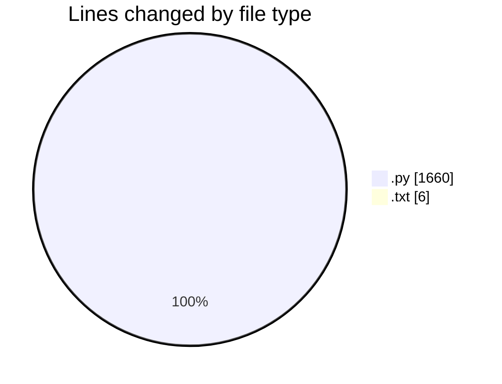
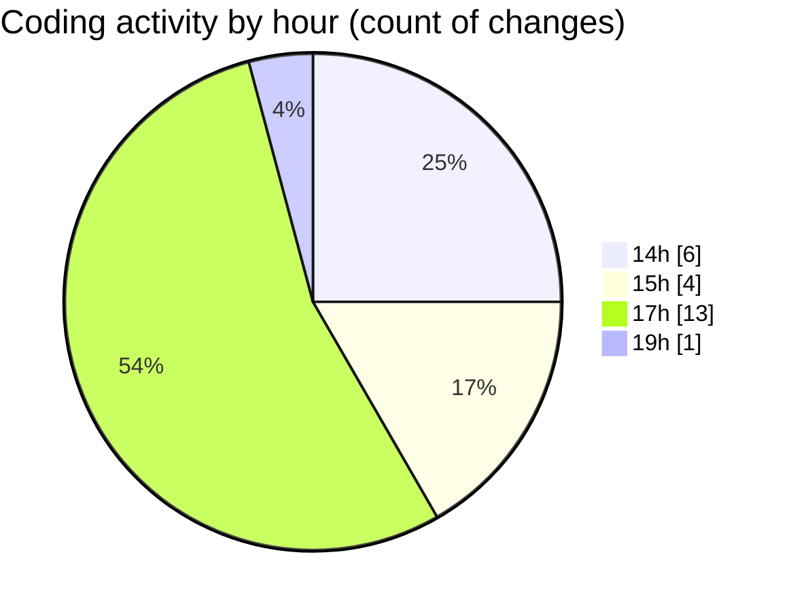

# toolsOpenEmalPass - Activity Summary 

## Overall Statistics

| Stat                   | Value                                                             |
| ---------------------- | ----------------------------------------------------------------- |
| **Lines Added** (➕)   | 1653                                          |
| **Lines Removed** (➖) | 13                                        |
| **Net Change** (↕)    | 1640                |
| **Active Time** (⌚)   | 26 minutes |

## Modified Files
- **gmail_app_password_gui.py** (+167, -0)
- **requirements.txt** (+6, -0)
- **gmail_app_password_modern_gui.py** (+400, -13)
- **main.py** (+21, -0)
- **utils.py** (+86, -0)
- **data_manager.py** (+160, -0)
- **gmail_automation.py** (+227, -0)
- **account_manager.py** (+319, -0)
- **gui_main.py** (+267, -0)

## Visualizations

### By File Type (Lines Changed)

### By Hour (Estimated Activity Count)

> **Last Updated:** 7/9/2025, 7:05:30 PM