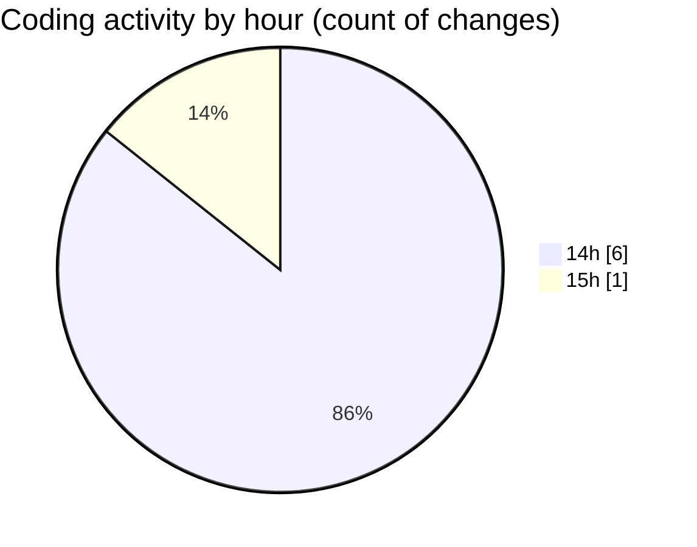

# toolsOpenEmalPass - Activity Summary 

## Overall Statistics

| Stat                   | Value                                                             |
| ---------------------- | ----------------------------------------------------------------- |
| **Lines Added** (➕)   | 419                                          |
| **Lines Removed** (➖) | 0                                        |
| **Net Change** (↕)    | 419                |
| **Active Time** (⌚)   | 11 minutes |

## Modified Files
- **gmail_app_password_gui.py** (+167, -0)
- **requirements.txt** (+3, -0)
- **gmail_app_password_modern_gui.py** (+249, -0)

## Visualizations

### By File Type (Lines Changed)

### By Hour (Estimated Activity Count)

> **Last Updated:** 7/9/2025, 3:07:16 PM