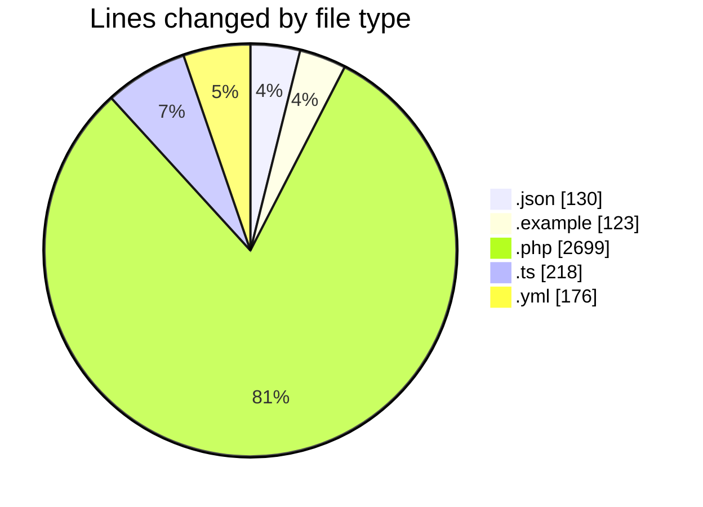
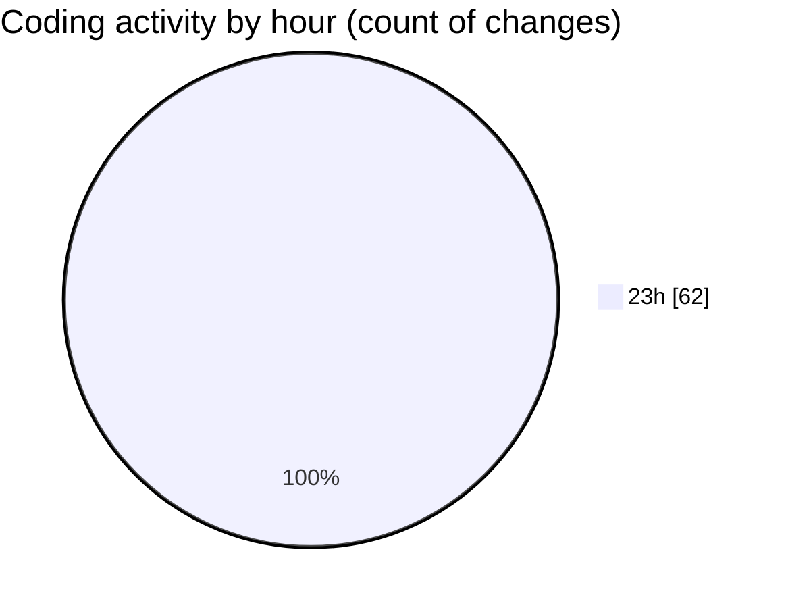

# shopaccv1 - Activity Summary 

## Overall Statistics

| Stat                   | Value                                                             |
| ---------------------- | ----------------------------------------------------------------- |
| **Lines Added** (➕)   | 3346                                          |
| **Lines Removed** (➖) | 0                                        |
| **Net Change** (↕)    | 3346                |
| **Active Time** (⌚)   | 64 minutes |

## Modified Files
- **composer.json** (+77, -0)
- **env.example** (+123, -0)
- **User.php** (+325, -0)
- **AuthController.php** (+457, -0)
- **ProductController.php** (+554, -0)
- **package.json** (+53, -0)
- **nuxt.config.ts** (+218, -0)
- **docker-compose.yml** (+176, -0)
- **2024_01_01_000001_create_users_table.php** (+50, -0)
- **2024_01_01_000002_create_oauth_accounts_table.php** (+36, -0)
- **2024_01_01_000003_create_categories_table.php** (+36, -0)
- **2024_01_01_000004_create_products_table.php** (+49, -0)
- **2024_01_01_000005_create_product_images_table.php** (+33, -0)
- **2024_01_01_000006_create_orders_table.php** (+47, -0)
- **2024_01_01_000007_create_transactions_table.php** (+43, -0)
- **2024_01_01_000008_create_game_wallets_table.php** (+33, -0)
- **2024_01_01_000009_create_withdrawal_requests_table.php** (+40, -0)
- **2024_01_01_000010_create_affiliate_logs_table.php** (+45, -0)
- **2024_01_01_000011_create_articles_table.php** (+41, -0)
- **2024_01_01_000012_create_settings_table.php** (+31, -0)
- **2024_01_01_000013_create_mini_games_table.php** (+31, -0)
- **2024_01_01_000014_create_game_rewards_table.php** (+41, -0)
- **2024_01_01_000015_create_payment_gateways_table.php** (+31, -0)
- **2024_01_01_000016_create_payment_logs_table.php** (+39, -0)
- **DatabaseSeeder.php** (+22, -0)
- **UserSeeder.php** (+112, -0)
- **CategorySeeder.php** (+105, -0)
- **ProductSeeder.php** (+189, -0)
- **SettingSeeder.php** (+146, -0)
- **MiniGameSeeder.php** (+90, -0)
- **Category.php** (+73, -0)

## Visualizations

### By File Type (Lines Changed)

### By Hour (Estimated Activity Count)

> **Last Updated:** 7/10/2025, 11:35:19 PM