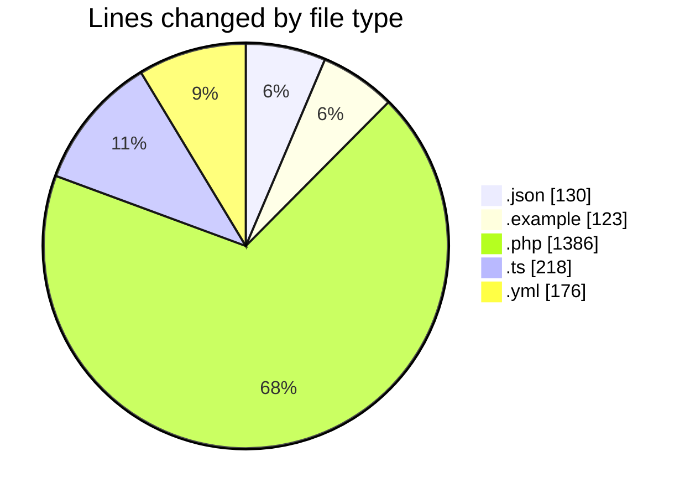

# shopaccv1 - Activity Summary 

## Overall Statistics

| Stat                   | Value                                                             |
| ---------------------- | ----------------------------------------------------------------- |
| **Lines Added** (➕)   | 2033                                          |
| **Lines Removed** (➖) | 0                                        |
| **Net Change** (↕)    | 2033                |
| **Active Time** (⌚)   | 20 minutes |

## Modified Files
- **composer.json** (+77, -0)
- **env.example** (+123, -0)
- **User.php** (+325, -0)
- **AuthController.php** (+457, -0)
- **ProductController.php** (+554, -0)
- **package.json** (+53, -0)
- **nuxt.config.ts** (+218, -0)
- **docker-compose.yml** (+176, -0)
- **2024_01_01_000001_create_users_table.php** (+50, -0)

## Visualizations

### By File Type (Lines Changed)

### By Hour (Estimated Activity Count)

> **Last Updated:** 7/10/2025, 11:30:19 PM