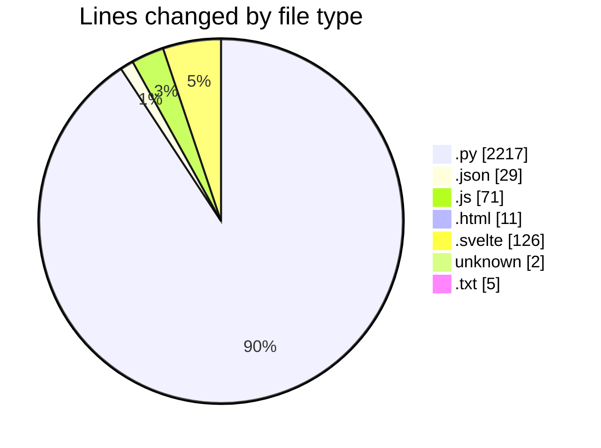

# toolsOpenEmalPass - Activity Summary 

## Overall Statistics

| Stat                   | Value                                                             |
| ---------------------- | ----------------------------------------------------------------- |
| **Lines Added** (➕)   | 1882                                          |
| **Lines Removed** (➖) | 579                                        |
| **Net Change** (↕)    | 1303                |
| **Active Time** (⌚)   | 73 minutes |

## Modified Files
- **account_manager.py** (+656, -318)
- **main.py** (+31, -20)
- **gmail_automation.py** (+477, -226)
- **package.json** (+24, -0)
- **main.js** (+23, -0)
- **preload.js** (+6, -0)
- **gmailAutomation.js** (+9, -0)
- **dataManager.js** (+15, -0)
- **utils.js** (+4, -0)
- **accounts.json** (+3, -2)
- **index.html** (+11, -0)
- **main.js** (+7, -0)
- **App.svelte** (+14, -0)
- **MainPage.svelte** (+16, -0)
- **AccountManagerPage.svelte** (+8, -0)
- **AccountForm.svelte** (+8, -0)
- **AccountTable.svelte** (+8, -0)
- **LogBox.svelte** (+9, -0)
- **App.svelte** (+14, -0)
- **main.js** (+7, -0)
- **MainPage.svelte** (+16, -0)
- **AccountManagerPage.svelte** (+8, -0)
- **AccountForm.svelte** (+8, -0)
- **AccountTable.svelte** (+8, -0)
- **LogBox.svelte** (+9, -0)
- **.npmrc** (+2, -0)
- **requirements.txt** (+3, -2)
- **gui_main.py** (+223, -0)
- **data_manager.py** (+125, -11)
- **utils.py** (+130, -0)

## Visualizations

### By File Type (Lines Changed)

### By Hour (Estimated Activity Count)

> **Last Updated:** 7/10/2025, 8:57:21 AM