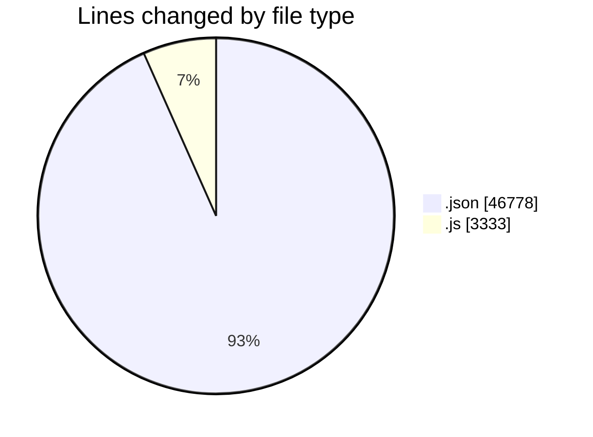
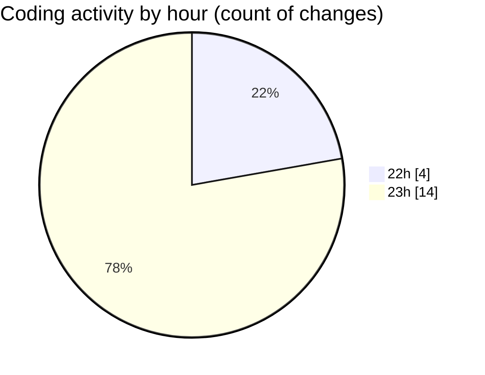

# eduWallet-main - Activity Summary 

## Overall Statistics

| Stat                   | Value                                                             |
| ---------------------- | ----------------------------------------------------------------- |
| **Lines Added** (➕)   | 37458                                          |
| **Lines Removed** (➖) | 12653                                        |
| **Net Change** (↕)    | 24805                |
| **Active Time** (⌚)   | 23 minutes |

## Modified Files
- **package.json** (+69, -0)
- **package-lock.json** (+34378, -12331)
- **Navbar.js** (+522, -0)
- **Login.js** (+273, -0)
- **Register.js** (+324, -0)
- **Dashboard.js** (+645, -322)
- **Transfer.js** (+50, -0)
- **Marketplace.js** (+133, -0)
- **LearnPass.js** (+165, -0)
- **Home.js** (+168, -0)
- **About.js** (+52, -0)
- **WalletContext.js** (+170, -0)
- **Sidebar.js** (+509, -0)

## Visualizations

### By File Type (Lines Changed)

### By Hour (Estimated Activity Count)

> **Last Updated:** 7/11/2025, 11:18:36 PM