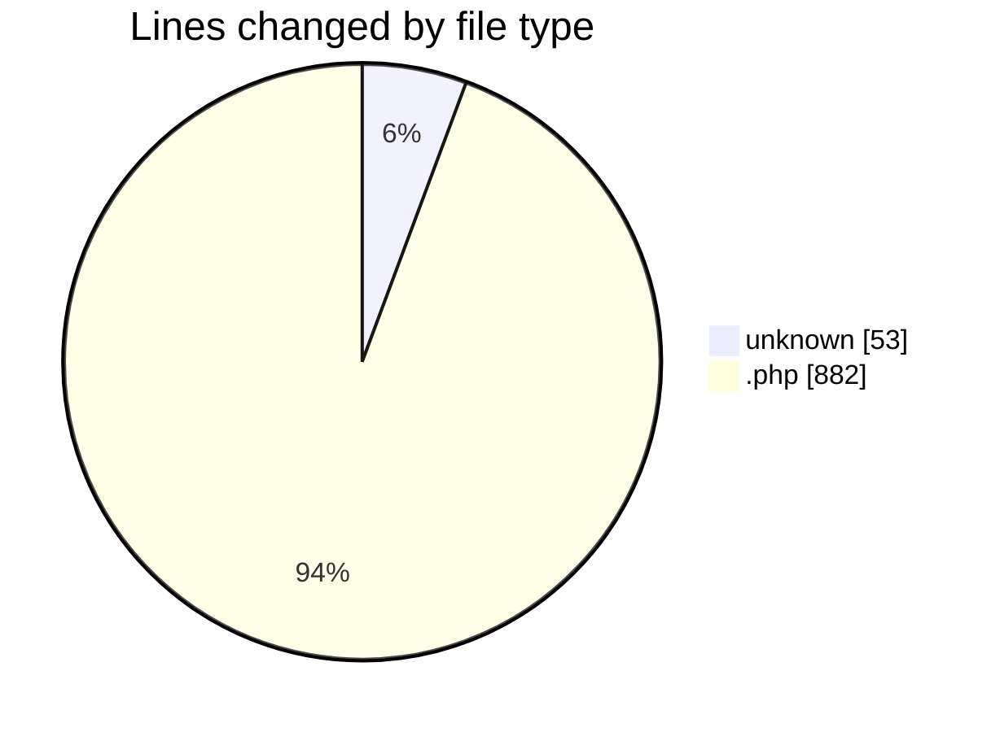
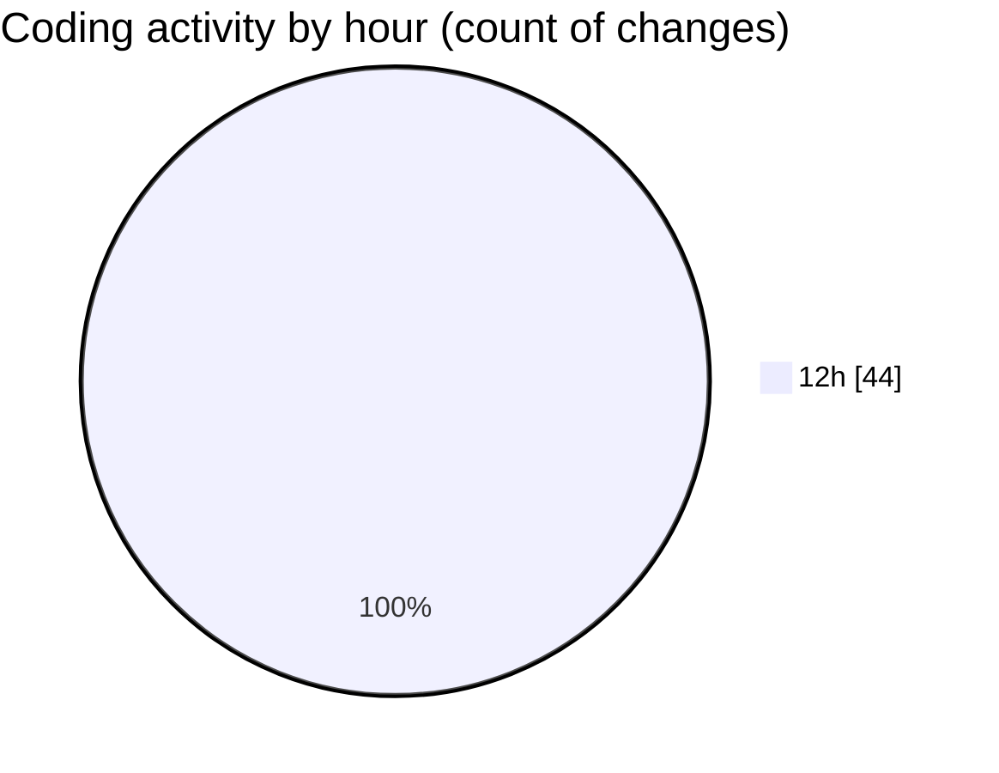

# shopaccv1 - Activity Summary 

## Overall Statistics

| Stat                   | Value                                                             |
| ---------------------- | ----------------------------------------------------------------- |
| **Lines Added** (➕)   | 935                                          |
| **Lines Removed** (➖) | 0                                        |
| **Net Change** (↕)    | 935                |
| **Active Time** (⌚)   | 43 minutes |

## Modified Files
- **artisan** (+53, -0)
- **app.php** (+55, -0)
- **Kernel.php** (+41, -0)
- **Kernel.php** (+68, -0)
- **Handler.php** (+30, -0)
- **TrustProxies.php** (+28, -0)
- **PreventRequestsDuringMaintenance.php** (+17, -0)
- **TrimStrings.php** (+19, -0)
- **EncryptCookies.php** (+17, -0)
- **VerifyCsrfToken.php** (+17, -0)
- **Authenticate.php** (+17, -0)
- **RedirectIfAuthenticated.php** (+30, -0)
- **ValidateSignature.php** (+22, -0)
- **web.php** (+18, -0)
- **api.php** (+19, -0)
- **console.php** (+18, -0)
- **RouteServiceProvider.php** (+40, -0)
- **app.php** (+188, -0)
- **database.php** (+151, -0)
- **AppServiceProvider.php** (+24, -0)
- **AuthServiceProvider.php** (+25, -0)
- **EventServiceProvider.php** (+38, -0)

## Visualizations

### By File Type (Lines Changed)

### By Hour (Estimated Activity Count)

> **Last Updated:** 7/11/2025, 12:34:02 PM