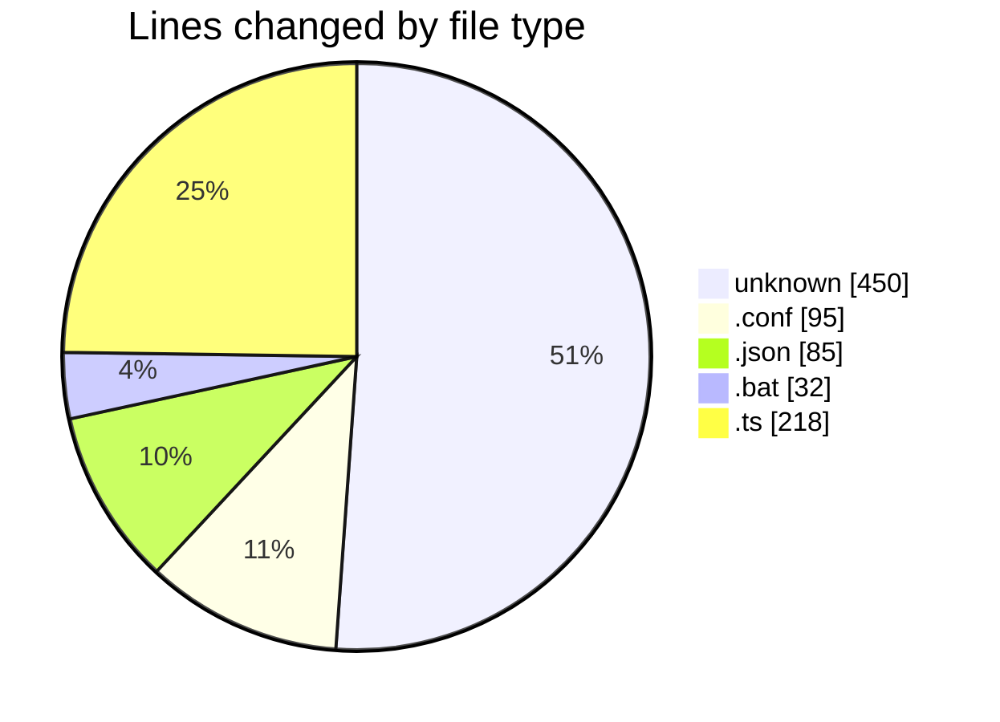
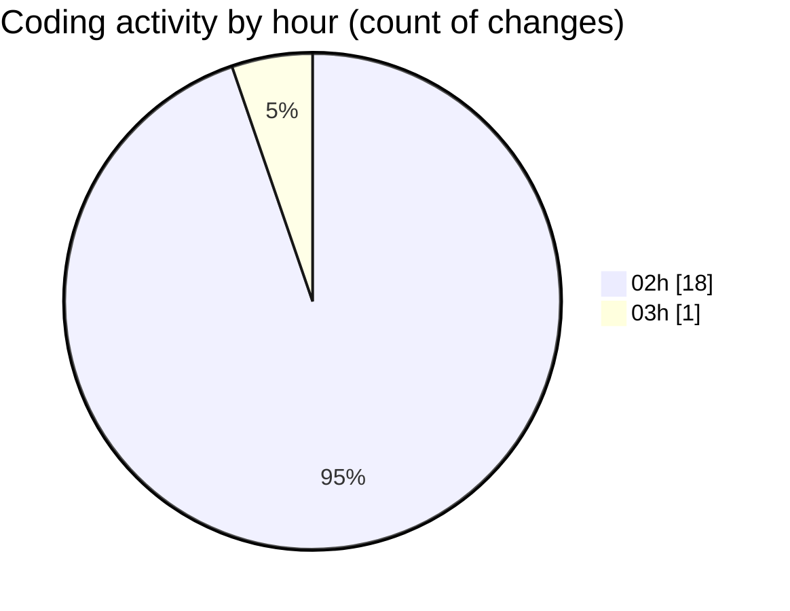

# shopaccv1 - Activity Summary 

## Overall Statistics

| Stat                   | Value                                                             |
| ---------------------- | ----------------------------------------------------------------- |
| **Lines Added** (➕)   | 749                                          |
| **Lines Removed** (➖) | 131                                        |
| **Net Change** (↕)    | 618                |
| **Active Time** (⌚)   | 21 minutes |

## Modified Files
- **Dockerfile** (+62, -0)
- **Dockerfile** (+19, -0)
- **nginx.conf** (+43, -0)
- **default.conf** (+52, -0)
- **.env** (+246, -123)
- **composer.json** (+77, -8)
- **install-dependencies.bat** (+32, -0)
- **nuxt.config.ts** (+218, -0)

## Visualizations

### By File Type (Lines Changed)

### By Hour (Estimated Activity Count)

> **Last Updated:** 7/12/2025, 3:38:26 AM