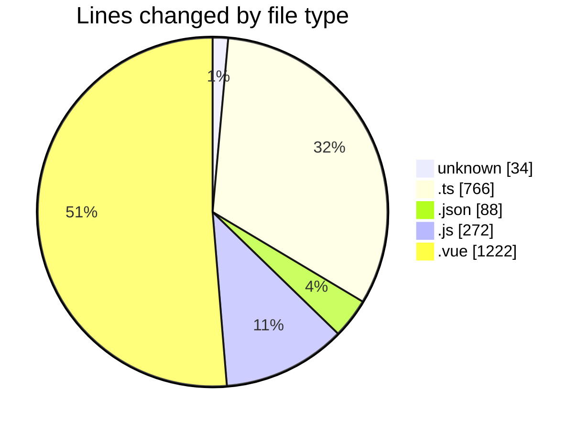
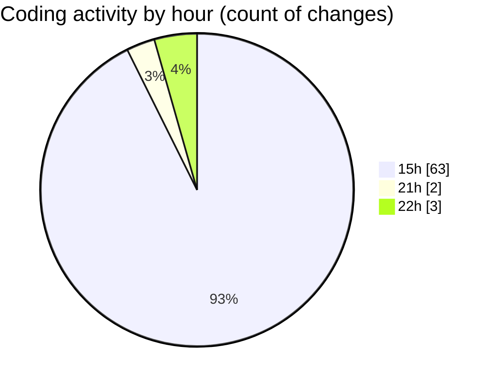

# rentOTP - Activity Summary 

## Overall Statistics

| Stat                   | Value                                                             |
| ---------------------- | ----------------------------------------------------------------- |
| **Lines Added** (➕)   | 2262                                          |
| **Lines Removed** (➖) | 120                                        |
| **Net Change** (↕)    | 2142                |
| **Active Time** (⌚)   | 78 minutes |

## Modified Files
- **.env** (+31, -3)
- **user.seed.ts** (+83, -1)
- **service.seed.ts** (+79, -1)
- **index.ts** (+30, -0)
- **database.module.ts** (+36, -0)
- **command.ts** (+27, -0)
- **package.json** (+88, -0)
- **seed.ts** (+11, -0)
- **user.schema.ts** (+54, -0)
- **service.schema.ts** (+36, -0)
- **app.module.ts** (+20, -0)
- **seed-script.ts** (+21, -0)
- **auth.module.ts** (+32, -0)
- **auth.service.ts** (+177, -0)
- **jwt.strategy.ts** (+23, -0)
- **auth.controller.ts** (+58, -0)
- **jwt-auth.guard.ts** (+5, -0)
- **roles.decorator.ts** (+4, -0)
- **roles.guard.ts** (+47, -0)
- **api.js** (+64, -0)
- **Login.vue** (+186, -0)
- **auth.guard.js** (+57, -2)
- **Landing.vue** (+636, -92)
- **AuthNavbar.vue** (+117, -12)
- **Footer.vue** (+172, -7)
- **main.js** (+149, -0)
- **main.ts** (+19, -2)

## Visualizations

### By File Type (Lines Changed)

### By Hour (Estimated Activity Count)

> **Last Updated:** 7/13/2025, 10:10:05 PM