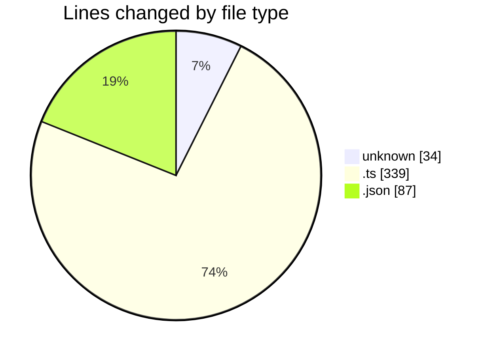

# rentOTP - Activity Summary 

## Overall Statistics

| Stat                   | Value                                                             |
| ---------------------- | ----------------------------------------------------------------- |
| **Lines Added** (➕)   | 455                                          |
| **Lines Removed** (➖) | 5                                        |
| **Net Change** (↕)    | 450                |
| **Active Time** (⌚)   | 30 minutes |

## Modified Files
- **.env** (+31, -3)
- **user.seed.ts** (+65, -1)
- **service.seed.ts** (+79, -1)
- **index.ts** (+30, -0)
- **database.module.ts** (+36, -0)
- **command.ts** (+23, -0)
- **package.json** (+87, -0)
- **seed.ts** (+11, -0)
- **user.schema.ts** (+39, -0)
- **service.schema.ts** (+36, -0)
- **app.module.ts** (+18, -0)

## Visualizations

### By File Type (Lines Changed)

### By Hour (Estimated Activity Count)

> **Last Updated:** 7/13/2025, 3:25:20 PM