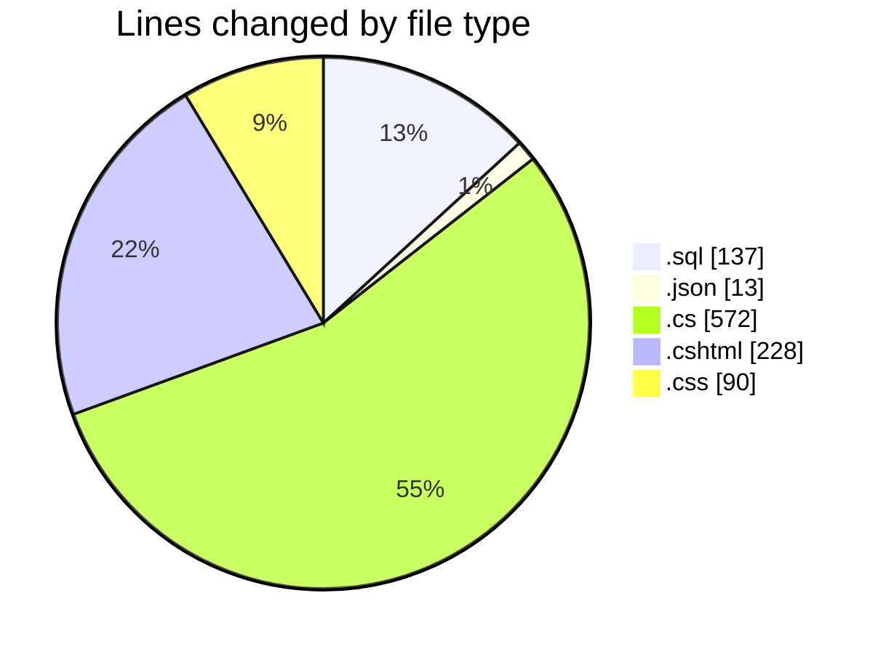
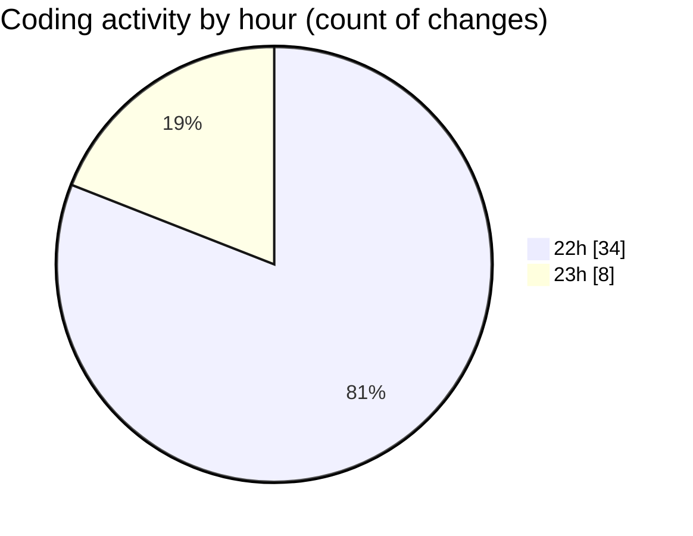

# nhaHang - Activity Summary 

## Overall Statistics

| Stat                   | Value                                                             |
| ---------------------- | ----------------------------------------------------------------- |
| **Lines Added** (➕)   | 1039                                          |
| **Lines Removed** (➖) | 1                                        |
| **Net Change** (↕)    | 1038                |
| **Active Time** (⌚)   | 46 minutes |

## Modified Files
- **sql.sql** (+137, -0)
- **appsettings.json** (+13, -0)
- **ChiNhanh.cs** (+42, -0)
- **KhuyenMai.cs** (+50, -0)
- **DanhMuc.cs** (+31, -0)
- **MonAn.cs** (+50, -0)
- **KhachHang.cs** (+39, -0)
- **DonHang.cs** (+58, -0)
- **ChiTietDonHang.cs** (+40, -0)
- **HoaDon.cs** (+43, -0)
- **QuanTriVien.cs** (+41, -0)
- **ApplicationDbContext.cs** (+65, -0)
- **Program.cs** (+41, -0)
- **SeedData.cs** (+71, -1)
- **_Layout.cshtml** (+128, -0)
- **site.css** (+90, -0)
- **Index.cshtml** (+100, -0)

## Visualizations

### By File Type (Lines Changed)

### By Hour (Estimated Activity Count)

> **Last Updated:** 7/14/2025, 11:26:00 PM