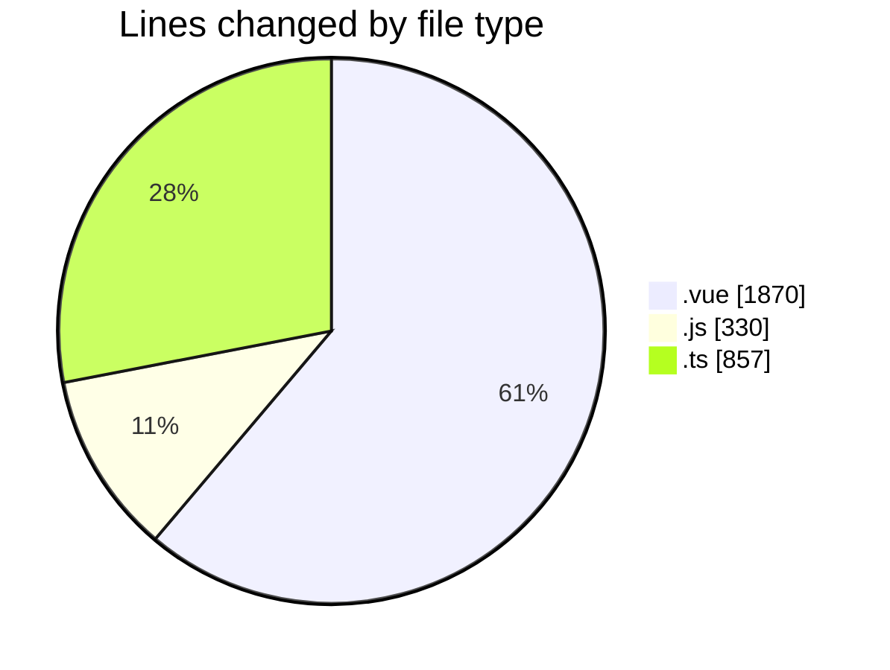
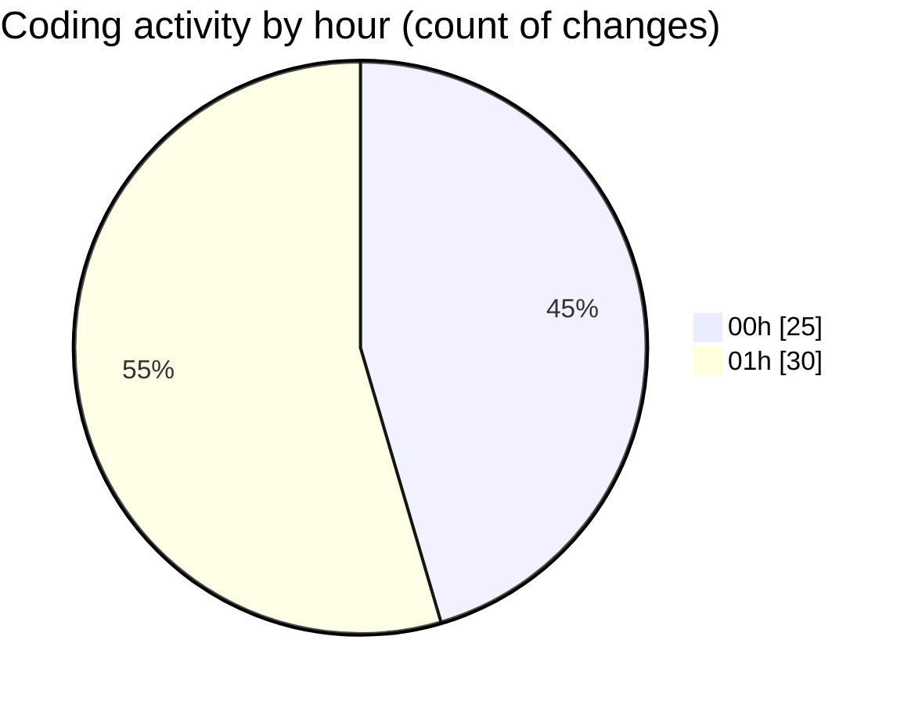

# rentOTP - Activity Summary 

## Overall Statistics

| Stat                   | Value                                                             |
| ---------------------- | ----------------------------------------------------------------- |
| **Lines Added** (➕)   | 3042                                          |
| **Lines Removed** (➖) | 15                                        |
| **Net Change** (↕)    | 3027                |
| **Active Time** (⌚)   | 59 minutes |

## Modified Files
- **Dashboard.vue** (+218, -0)
- **RentOTP.vue** (+290, -3)
- **History.vue** (+442, -0)
- **Deposit.vue** (+414, -3)
- **Profile.vue** (+491, -9)
- **main.js** (+195, -0)
- **api.js** (+87, -0)
- **apiService.js** (+48, -0)
- **otp.module.ts** (+13, -0)
- **otp-order.entity.ts** (+55, -0)
- **rent-otp.dto.ts** (+11, -0)
- **otp.service.ts** (+164, -0)
- **otp.controller.ts** (+36, -0)
- **deposit.module.ts** (+13, -0)
- **deposit.entity.ts** (+54, -0)
- **create-deposit.dto.ts** (+13, -0)
- **deposit.service.ts** (+147, -0)
- **deposit.controller.ts** (+30, -0)
- **client.module.ts** (+15, -0)
- **client.service.ts** (+167, -0)
- **client.controller.ts** (+45, -0)
- **otp-order.schema.ts** (+47, -0)
- **deposit.schema.ts** (+47, -0)

## Visualizations

### By File Type (Lines Changed)

### By Hour (Estimated Activity Count)

> **Last Updated:** 7/14/2025, 1:07:11 AM