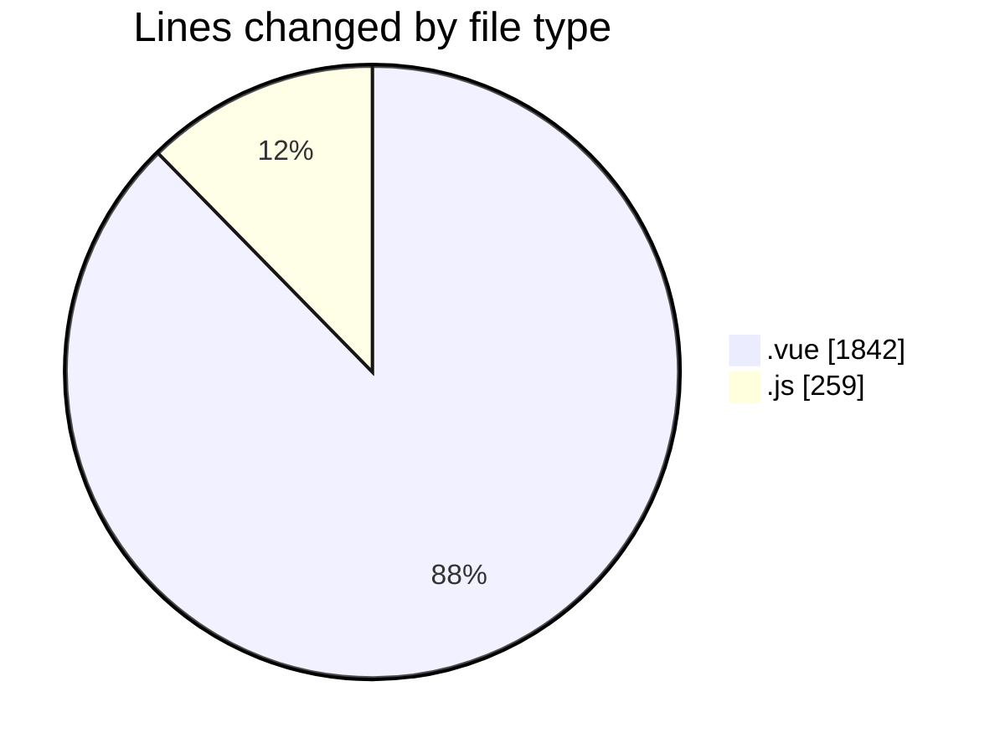
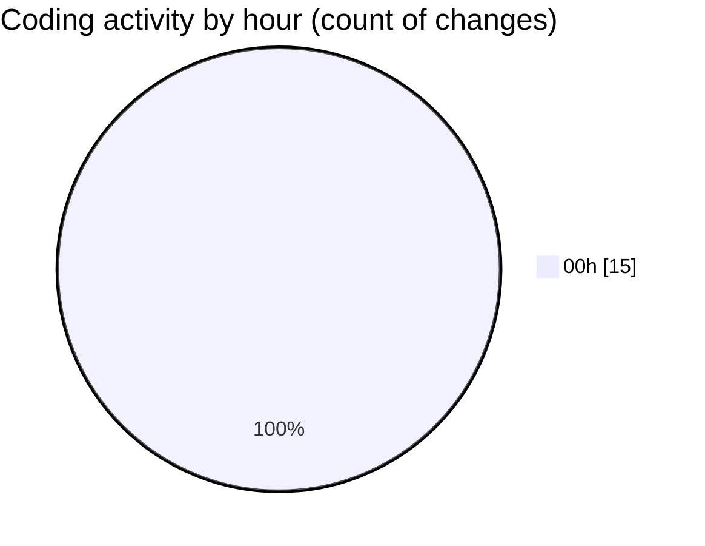

# rentOTP - Activity Summary 

## Overall Statistics

| Stat                   | Value                                                             |
| ---------------------- | ----------------------------------------------------------------- |
| **Lines Added** (➕)   | 2101                                          |
| **Lines Removed** (➖) | 0                                        |
| **Net Change** (↕)    | 2101                |
| **Active Time** (⌚)   | 18 minutes |

## Modified Files
- **Dashboard.vue** (+208, -0)
- **RentOTP.vue** (+287, -0)
- **History.vue** (+442, -0)
- **Deposit.vue** (+414, -0)
- **Profile.vue** (+491, -0)
- **main.js** (+195, -0)
- **api.js** (+64, -0)

## Visualizations

### By File Type (Lines Changed)

### By Hour (Estimated Activity Count)

> **Last Updated:** 7/14/2025, 12:32:11 AM