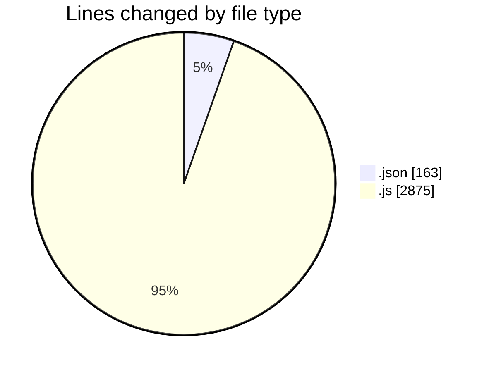
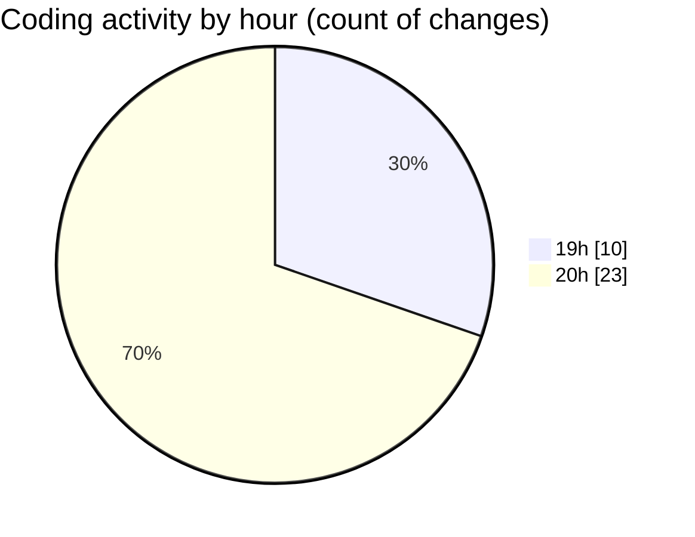

# eduWallet-main - Activity Summary 

## Overall Statistics

| Stat                   | Value                                                             |
| ---------------------- | ----------------------------------------------------------------- |
| **Lines Added** (➕)   | 3000                                          |
| **Lines Removed** (➖) | 38                                        |
| **Net Change** (↕)    | 2962                |
| **Active Time** (⌚)   | 47 minutes |

## Modified Files
- **package.json** (+19, -0)
- **Home.js** (+168, -0)
- **About.js** (+52, -0)
- **Marketplace.js** (+140, -0)
- **LearnPass.js** (+174, -0)
- **Verify.js** (+95, -0)
- **Badges.js** (+72, -0)
- **demoData.json** (+103, -0)
- **Sidebar.js** (+511, -0)
- **Dashboard.js** (+477, -4)
- **LinkedAccounts.js** (+168, -0)
- **App.js** (+128, -0)
- **Register.js** (+331, -0)
- **Login.js** (+280, -0)
- **WalletContext.js** (+170, -34)
- **Transfer.js** (+71, -0)
- **users.json** (+41, -0)

## Visualizations

### By File Type (Lines Changed)

### By Hour (Estimated Activity Count)

> **Last Updated:** 7/15/2025, 8:45:09 PM