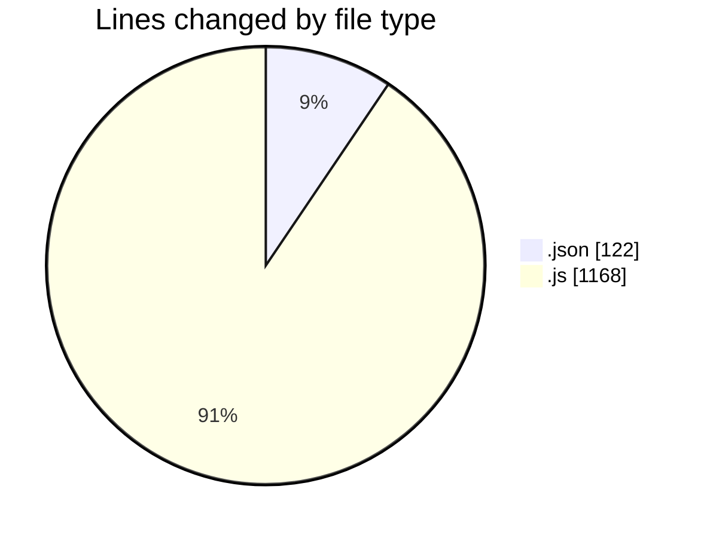

# eduWallet-main - Activity Summary 

## Overall Statistics

| Stat                   | Value                                                             |
| ---------------------- | ----------------------------------------------------------------- |
| **Lines Added** (➕)   | 1290                                          |
| **Lines Removed** (➖) | 0                                        |
| **Net Change** (↕)    | 1290                |
| **Active Time** (⌚)   | 9 minutes |

## Modified Files
- **package.json** (+19, -0)
- **Home.js** (+168, -0)
- **About.js** (+52, -0)
- **Marketplace.js** (+133, -0)
- **LearnPass.js** (+165, -0)
- **Verify.js** (+70, -0)
- **Badges.js** (+71, -0)
- **demoData.json** (+103, -0)
- **Sidebar.js** (+509, -0)

## Visualizations

### By File Type (Lines Changed)

### By Hour (Estimated Activity Count)

> **Last Updated:** 7/15/2025, 7:50:09 PM