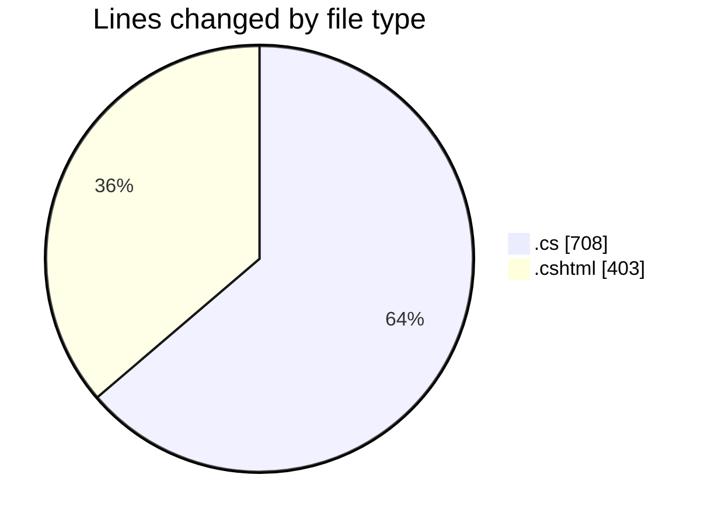
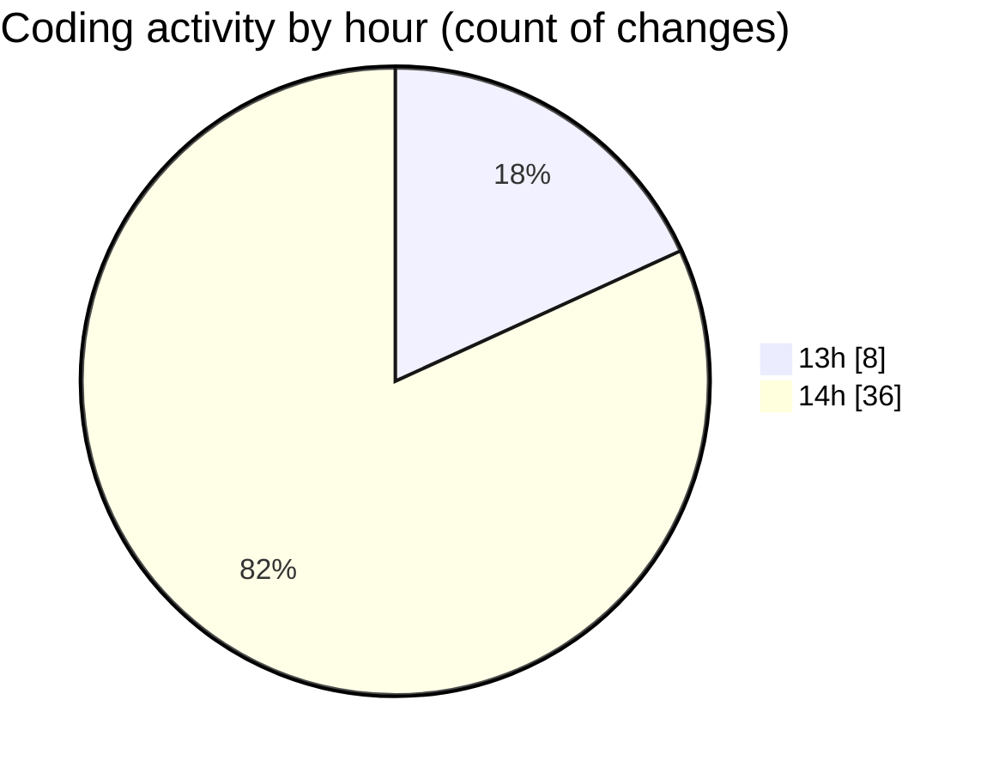

# FootballStatsApp - Activity Summary 

## Overall Statistics

| Stat                   | Value                                                             |
| ---------------------- | ----------------------------------------------------------------- |
| **Lines Added** (➕)   | 1108                                          |
| **Lines Removed** (➖) | 3                                        |
| **Net Change** (↕)    | 1105                |
| **Active Time** (⌚)   | 56 minutes |

## Modified Files
- **DoiBong.cs** (+46, -0)
- **TruongHoc.cs** (+18, -0)
- **ErrorViewModel.cs** (+9, -0)
- **ApplicationDbContext.cs** (+37, -0)
- **Index.cshtml.cs** (+33, -0)
- **Create.cshtml.cs** (+56, -0)
- **Edit.cshtml.cs** (+61, -0)
- **Details.cshtml.cs** (+28, -0)
- **Delete.cshtml.cs** (+39, -0)
- **_Layout.cshtml** (+75, -0)
- **Index.cshtml** (+62, -3)
- **Create.cshtml** (+55, -0)
- **Edit.cshtml** (+66, -0)
- **Details.cshtml** (+43, -0)
- **Delete.cshtml** (+47, -0)
- **Index.cshtml** (+11, -0)
- **Privacy.cshtml** (+9, -0)
- **Error.cshtml** (+27, -0)
- **_ValidationScriptsPartial.cshtml** (+5, -0)
- **Program.cs** (+40, -0)
- **Stats.cshtml.cs** (+107, -0)
- **Login.cshtml.cs** (+59, -0)
- **Register.cshtml.cs** (+61, -0)
- **EditMatch.cshtml.cs** (+68, -0)
- **SelectMatch.cshtml.cs** (+46, -0)

## Visualizations

### By File Type (Lines Changed)

### By Hour (Estimated Activity Count)

> **Last Updated:** 7/15/2025, 2:59:24 PM