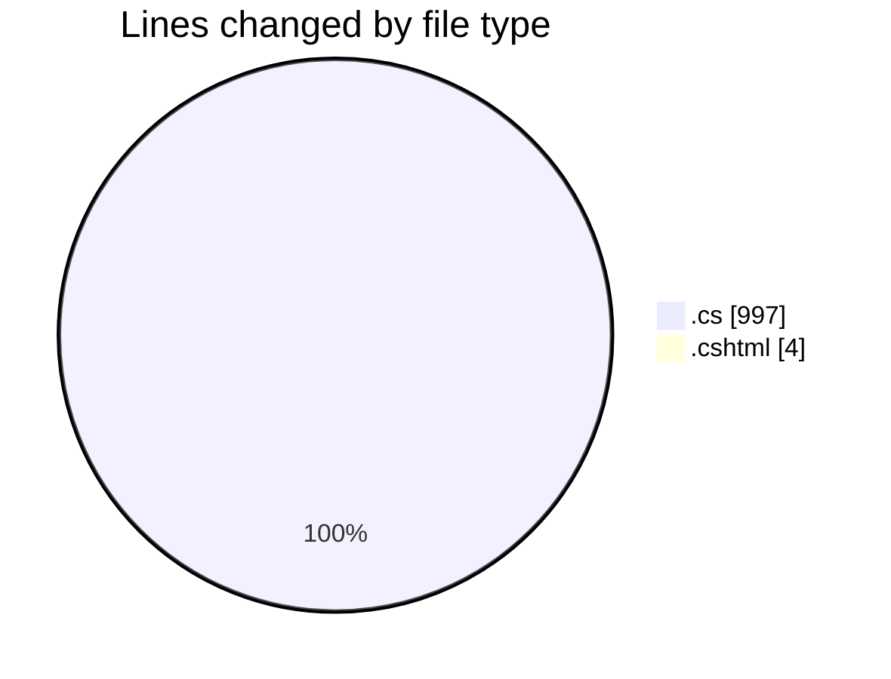
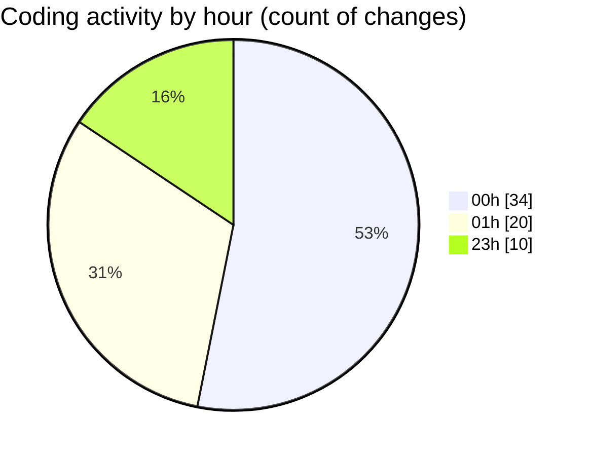

# nhaHang - Activity Summary 

## Overall Statistics

| Stat                   | Value                                                             |
| ---------------------- | ----------------------------------------------------------------- |
| **Lines Added** (➕)   | 1001                                          |
| **Lines Removed** (➖) | 0                                        |
| **Net Change** (↕)    | 1001                |
| **Active Time** (⌚)   | 62 minutes |

## Modified Files
- **Index.cshtml.cs** (+22, -0)
- **Create.cshtml.cs** (+40, -0)
- **Edit.cshtml.cs** (+35, -0)
- **Delete.cshtml.cs** (+34, -0)
- **Details.cshtml.cs** (+21, -0)
- **Index.cshtml.cs** (+22, -0)
- **Create.cshtml.cs** (+29, -0)
- **Edit.cshtml.cs** (+35, -0)
- **Delete.cshtml.cs** (+34, -0)
- **Details.cshtml.cs** (+21, -0)
- **Index.cshtml.cs** (+22, -0)
- **Create.cshtml.cs** (+40, -0)
- **Edit.cshtml.cs** (+35, -0)
- **Delete.cshtml.cs** (+34, -0)
- **Details.cshtml.cs** (+21, -0)
- **ImageService.cs** (+30, -0)
- **Create.cshtml** (+4, -0)
- **Create.cshtml.cs** (+11, -0)
- **DanhMucService.cs** (+47, -0)
- **KhachHangService.cs** (+47, -0)
- **QuanTriVienService.cs** (+47, -0)
- **ShopService.cs** (+50, -0)
- **Index.cshtml.cs** (+24, -0)
- **Create.cshtml.cs** (+34, -0)
- **Edit.cshtml.cs** (+40, -0)
- **Delete.cshtml.cs** (+39, -0)
- **Details.cshtml.cs** (+23, -0)
- **Index.cshtml.cs** (+24, -0)
- **Create.cshtml.cs** (+34, -0)
- **Edit.cshtml.cs** (+40, -0)
- **Delete.cshtml.cs** (+39, -0)
- **Details.cshtml.cs** (+23, -0)

## Visualizations

### By File Type (Lines Changed)

### By Hour (Estimated Activity Count)

> **Last Updated:** 7/15/2025, 1:39:41 AM