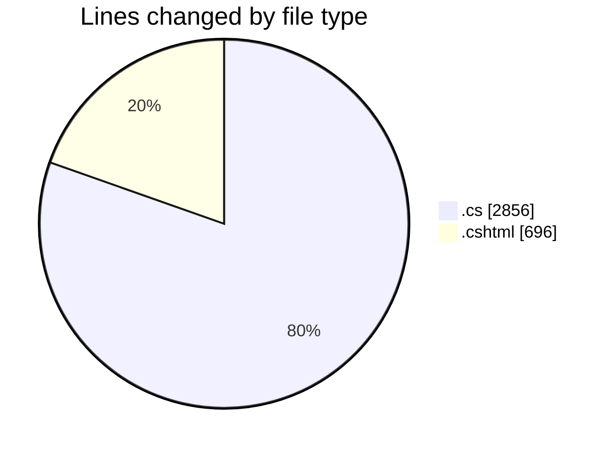
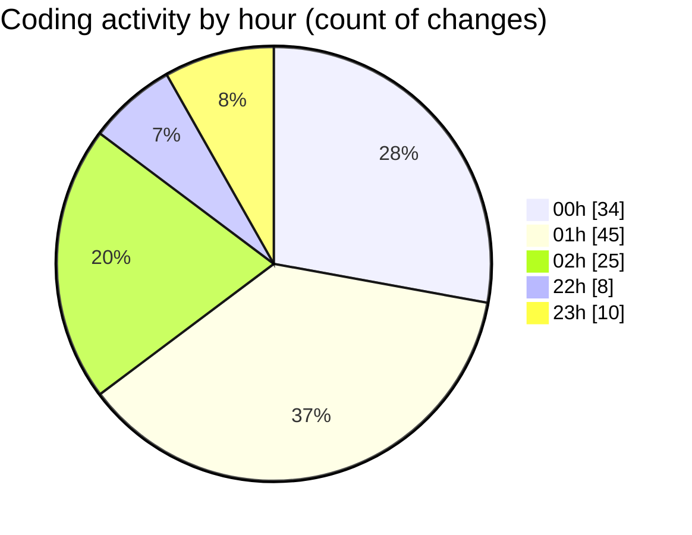

# nhaHang - Activity Summary 

## Overall Statistics

| Stat                   | Value                                                             |
| ---------------------- | ----------------------------------------------------------------- |
| **Lines Added** (➕)   | 3520                                          |
| **Lines Removed** (➖) | 32                                        |
| **Net Change** (↕)    | 3488                |
| **Active Time** (⌚)   | 123 minutes |

## Modified Files
- **Index.cshtml.cs** (+22, -0)
- **Create.cshtml.cs** (+40, -0)
- **Edit.cshtml.cs** (+35, -0)
- **Delete.cshtml.cs** (+34, -0)
- **Details.cshtml.cs** (+21, -0)
- **Index.cshtml.cs** (+22, -0)
- **Create.cshtml.cs** (+29, -0)
- **Edit.cshtml.cs** (+35, -0)
- **Delete.cshtml.cs** (+34, -0)
- **Details.cshtml.cs** (+21, -0)
- **Index.cshtml.cs** (+22, -0)
- **Create.cshtml.cs** (+40, -0)
- **Edit.cshtml.cs** (+35, -0)
- **Delete.cshtml.cs** (+34, -0)
- **Details.cshtml.cs** (+21, -0)
- **ImageService.cs** (+30, -0)
- **Create.cshtml** (+4, -0)
- **Create.cshtml.cs** (+11, -0)
- **DanhMucService.cs** (+47, -0)
- **KhachHangService.cs** (+47, -0)
- **QuanTriVienService.cs** (+99, -0)
- **ShopService.cs** (+50, -0)
- **Index.cshtml.cs** (+24, -0)
- **Create.cshtml.cs** (+34, -0)
- **Edit.cshtml.cs** (+40, -0)
- **Delete.cshtml.cs** (+39, -0)
- **Details.cshtml.cs** (+23, -0)
- **Index.cshtml.cs** (+24, -0)
- **Create.cshtml.cs** (+34, -0)
- **Edit.cshtml.cs** (+40, -0)
- **Delete.cshtml.cs** (+39, -0)
- **Details.cshtml.cs** (+23, -0)
- **Index.cshtml.cs** (+24, -0)
- **Create.cshtml.cs** (+34, -0)
- **Edit.cshtml.cs** (+40, -0)
- **Delete.cshtml.cs** (+39, -0)
- **Details.cshtml.cs** (+23, -0)
- **Index.cshtml.cs** (+26, -0)
- **Create.cshtml.cs** (+37, -0)
- **Edit.cshtml.cs** (+44, -0)
- **Delete.cshtml.cs** (+44, -0)
- **Details.cshtml.cs** (+31, -0)
- **20250714155907_InitialCreate.Designer.cs** (+570, -0)
- **ApplicationDbContextModelSnapshot.cs** (+567, -0)
- **ChiNhanh.cs** (+2, -0)
- **SeedData.cs** (+12, -0)
- **Login.cshtml** (+53, -0)
- **Login.cshtml.cs** (+96, -0)
- **_AdminLayout.cshtml** (+125, -0)
- **_ViewStart.cshtml** (+3, -0)
- **_ViewImports.cshtml** (+5, -0)
- **Index.cshtml** (+184, -0)
- **Index.cshtml.cs** (+65, -0)
- **Index.cshtml** (+135, -0)
- **Index.cshtml.cs** (+36, -0)
- **_Layout.cshtml** (+128, -32)
- **Program.cs** (+117, -0)
- **_AdminLoginLayout.cshtml** (+27, -0)

## Visualizations

### By File Type (Lines Changed)

### By Hour (Estimated Activity Count)

> **Last Updated:** 7/15/2025, 10:55:58 PM