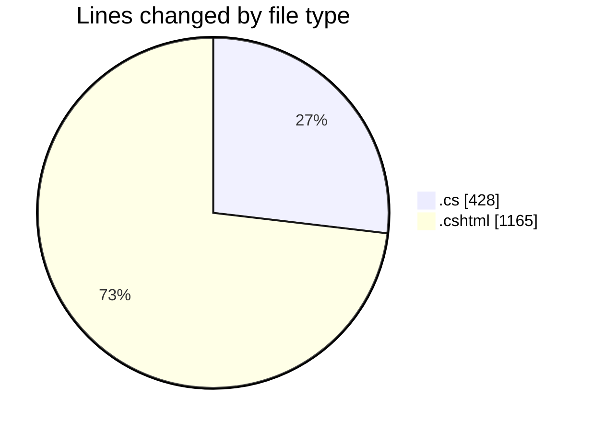
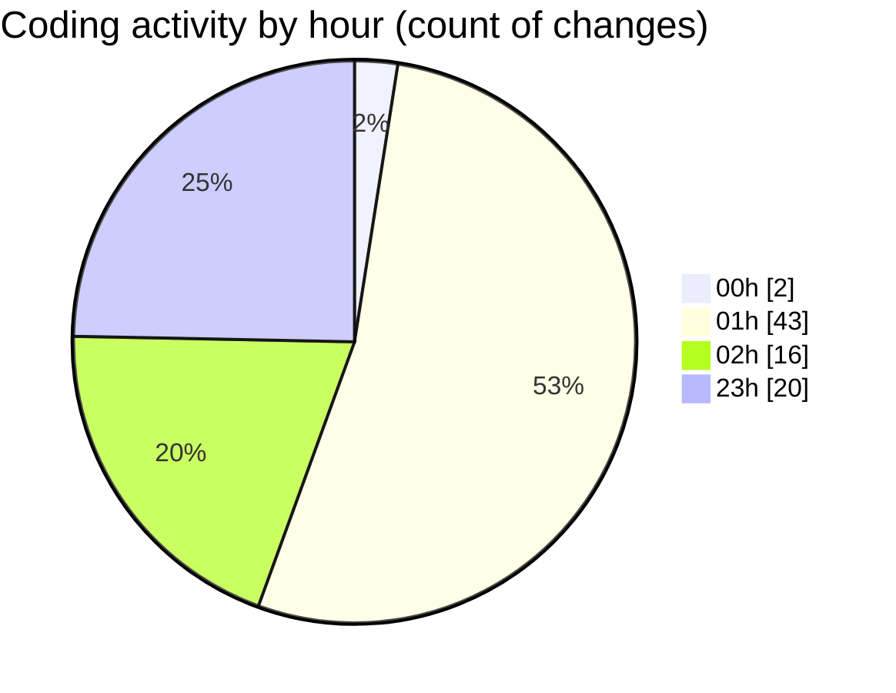

# nhaHang - Activity Summary 

## Overall Statistics

| Stat                   | Value                                                             |
| ---------------------- | ----------------------------------------------------------------- |
| **Lines Added** (➕)   | 1552                                          |
| **Lines Removed** (➖) | 41                                        |
| **Net Change** (↕)    | 1511                |
| **Active Time** (⌚)   | 88 minutes |

## Modified Files
- **Index.cshtml.cs** (+24, -0)
- **Create.cshtml.cs** (+34, -0)
- **Edit.cshtml.cs** (+40, -0)
- **Details.cshtml.cs** (+23, -0)
- **Delete.cshtml.cs** (+39, -0)
- **_AdminLayout.cshtml** (+6, -6)
- **Index.cshtml** (+40, -0)
- **Index.cshtml** (+38, -0)
- **Create.cshtml** (+41, -0)
- **Edit.cshtml** (+46, -0)
- **Details.cshtml** (+15, -0)
- **Delete.cshtml** (+19, -0)
- **Create.cshtml** (+67, -0)
- **Edit.cshtml** (+28, -0)
- **Details.cshtml** (+13, -0)
- **Delete.cshtml** (+19, -0)
- **Index.cshtml** (+73, -0)
- **Index.cshtml** (+87, -32)
- **Index.cshtml** (+82, -0)
- **Index.cshtml** (+117, -0)
- **Index.cshtml** (+80, -0)
- **MenuService.cs** (+52, -0)
- **Create.cshtml** (+134, -0)
- **Edit.cshtml** (+159, -0)
- **Delete.cshtml** (+22, -0)
- **Details.cshtml** (+41, -0)
- **MonAn.cs** (+103, -3)
- **Edit.cshtml.cs** (+57, -0)
- **Create.cshtml.cs** (+53, -0)

## Visualizations

### By File Type (Lines Changed)

### By Hour (Estimated Activity Count)

> **Last Updated:** 7/16/2025, 11:44:44 PM