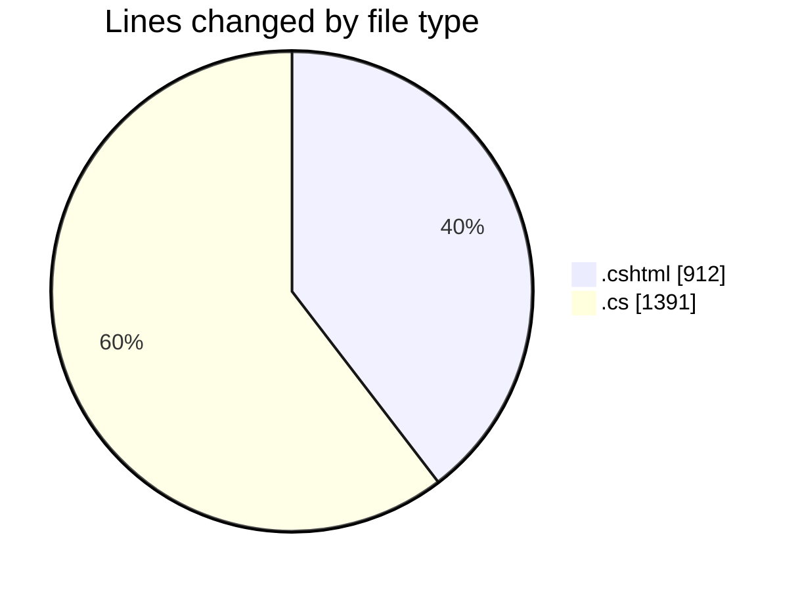
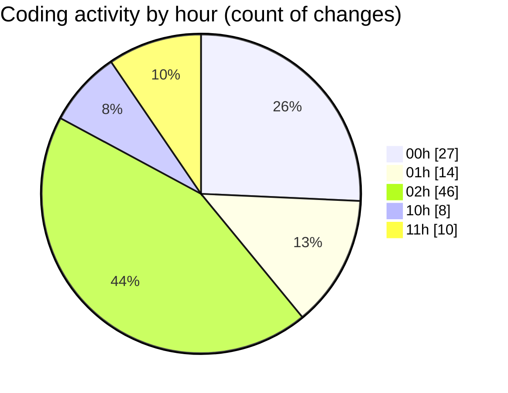

# nhaHang - Activity Summary 

## Overall Statistics

| Stat                   | Value                                                             |
| ---------------------- | ----------------------------------------------------------------- |
| **Lines Added** (➕)   | 2008                                          |
| **Lines Removed** (➖) | 295                                        |
| **Net Change** (↕)    | 1713                |
| **Active Time** (⌚)   | 123 minutes |

## Modified Files
- **Create.cshtml** (+61, -2)
- **Create.cshtml.cs** (+49, -0)
- **QuanTriVien.cs** (+44, -0)
- **Edit.cshtml** (+47, -0)
- **Edit.cshtml.cs** (+52, -0)
- **Index.cshtml** (+86, -0)
- **Create.cshtml.cs** (+55, -0)
- **Edit.cshtml.cs** (+44, -0)
- **Create.cshtml** (+120, -39)
- **MarketingService.cs** (+55, -0)
- **KhuyenMai.cs** (+54, -0)
- **Edit.cshtml** (+111, -25)
- **Delete.cshtml** (+26, -0)
- **Index.cshtml** (+60, -0)
- **Index.cshtml.cs** (+310, -178)
- **Details.cshtml** (+28, -0)
- **Details.cshtml.cs** (+78, -0)
- **Create.cshtml** (+45, -0)
- **Create.cshtml.cs** (+213, -0)
- **Index.cshtml** (+36, -0)
- **Index.cshtml.cs** (+46, -1)
- **Index.cshtml** (+33, -0)
- **Index.cshtml.cs** (+45, -0)
- **Index.cshtml** (+79, -46)
- **Index.cshtml.cs** (+26, -4)
- **Register.cshtml** (+38, -0)
- **Register.cshtml.cs** (+48, -0)
- **Login.cshtml** (+30, -0)
- **Login.cshtml.cs** (+42, -0)
- **MenuIndex.cshtml.cs** (+47, -0)

## Visualizations

### By File Type (Lines Changed)

### By Hour (Estimated Activity Count)

> **Last Updated:** 7/17/2025, 11:06:53 AM