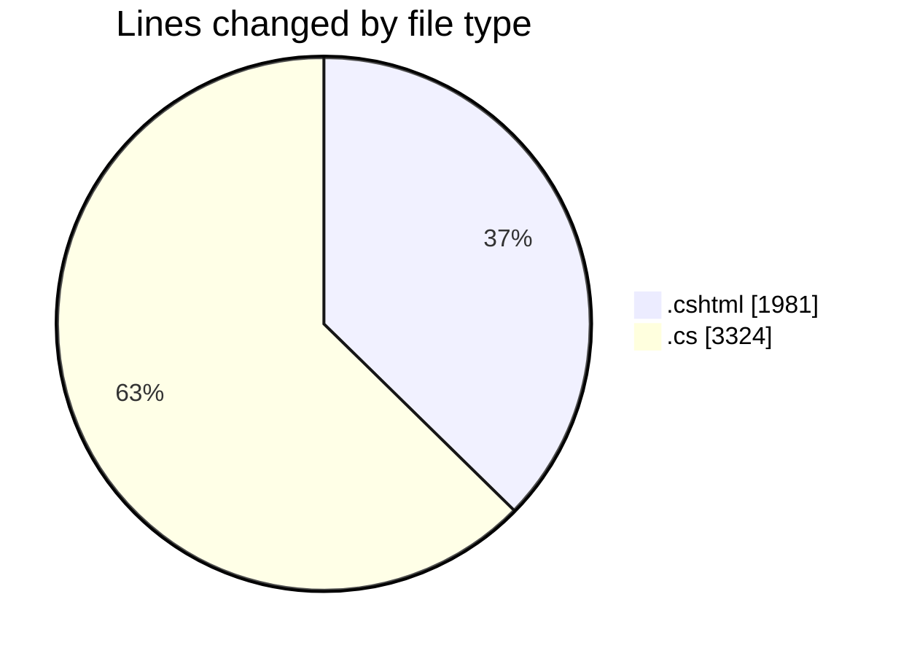
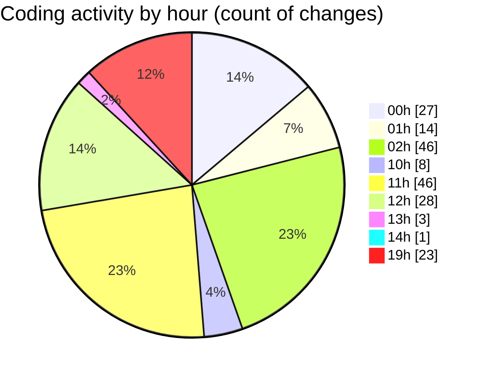

# nhaHang - Activity Summary 

## Overall Statistics

| Stat                   | Value                                                             |
| ---------------------- | ----------------------------------------------------------------- |
| **Lines Added** (➕)   | 4773                                          |
| **Lines Removed** (➖) | 532                                        |
| **Net Change** (↕)    | 4241                |
| **Active Time** (⌚)   | 216 minutes |

## Modified Files
- **Create.cshtml** (+120, -2)
- **Create.cshtml.cs** (+49, -0)
- **QuanTriVien.cs** (+91, -0)
- **Edit.cshtml** (+94, -0)
- **Edit.cshtml.cs** (+52, -0)
- **Index.cshtml** (+86, -0)
- **Create.cshtml.cs** (+55, -0)
- **Edit.cshtml.cs** (+44, -0)
- **Create.cshtml** (+120, -39)
- **MarketingService.cs** (+55, -0)
- **KhuyenMai.cs** (+54, -0)
- **Edit.cshtml** (+111, -25)
- **Delete.cshtml** (+26, -0)
- **Index.cshtml** (+120, -0)
- **Index.cshtml.cs** (+358, -227)
- **Details.cshtml** (+56, -0)
- **Details.cshtml.cs** (+105, -27)
- **Create.cshtml** (+90, -0)
- **Create.cshtml.cs** (+291, -78)
- **Index.cshtml** (+72, -0)
- **Index.cshtml.cs** (+94, -25)
- **Index.cshtml** (+66, -0)
- **Index.cshtml.cs** (+93, -24)
- **Index.cshtml** (+79, -46)
- **Index.cshtml.cs** (+26, -4)
- **Register.cshtml** (+38, -0)
- **Register.cshtml.cs** (+48, -0)
- **Login.cshtml** (+30, -0)
- **Login.cshtml.cs** (+122, -0)
- **MenuIndex.cshtml.cs** (+47, -0)
- **Index.cshtml.cs** (+26, -0)
- **Create.cshtml.cs** (+237, -27)
- **SessionExtensions.cs** (+19, -0)
- **Create.cshtml** (+200, -0)
- **ShopService.cs** (+123, -8)
- **CartItem.cs** (+12, -0)
- **Program.cs** (+81, -0)
- **Logout.cshtml.cs** (+15, -0)
- **Logout.cshtml** (+10, -0)
- **Index.cshtml** (+125, -0)
- **Index.cshtml.cs** (+102, -0)
- **Details.cshtml** (+104, -0)
- **Details.cshtml.cs** (+38, -0)
- **Edit.cshtml** (+77, -0)
- **Edit.cshtml.cs** (+62, -0)
- **_AdminLayout.cshtml** (+146, -0)
- **DonHang.cs** (+61, -0)
- **_Layout.cshtml** (+99, -0)
- **SeedData.cs** (+82, -0)
- **Login.cshtml.cs** (+62, -0)
- **Create.cshtml.cs** (+34, -0)
- **Edit.cshtml.cs** (+40, -0)
- **Details.cshtml.cs** (+23, -0)
- **Index.cshtml.cs** (+24, -0)
- **Delete.cshtml.cs** (+39, -0)
- **Index.cshtml.cs** (+65, -0)
- **Details.cshtml.cs** (+23, -0)
- **Index.cshtml.cs** (+24, -0)
- **Edit.cshtml.cs** (+40, -0)
- **Create.cshtml.cs** (+49, -0)
- **Delete.cshtml.cs** (+39, -0)

## Visualizations

### By File Type (Lines Changed)

### By Hour (Estimated Activity Count)

> **Last Updated:** 7/17/2025, 8:01:33 PM