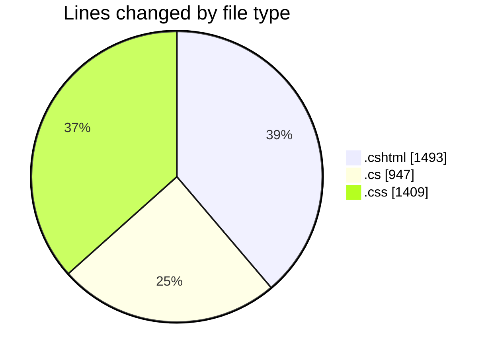
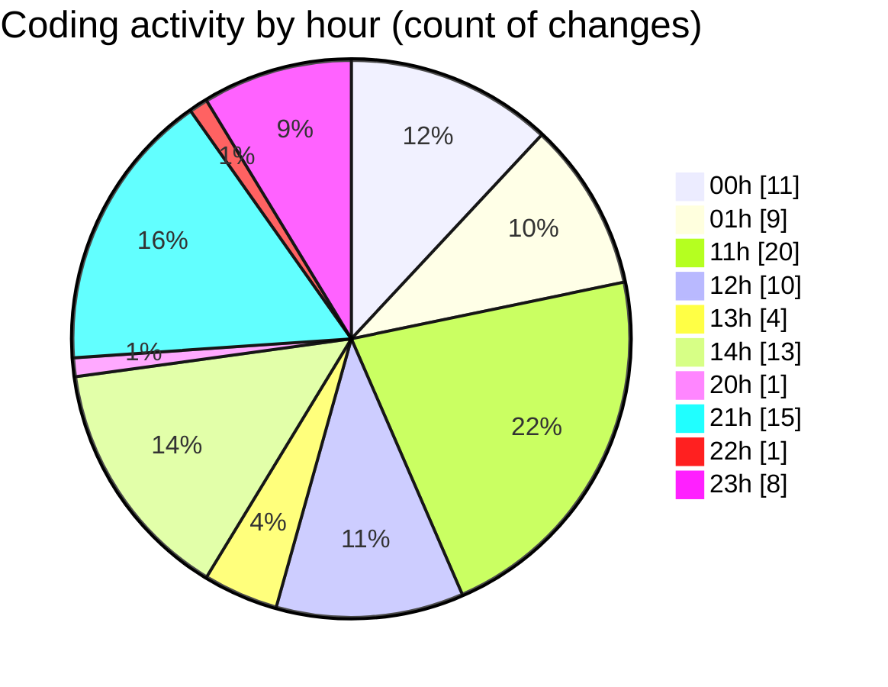

# nhaHang - Activity Summary 

## Overall Statistics

| Stat                   | Value                                                             |
| ---------------------- | ----------------------------------------------------------------- |
| **Lines Added** (➕)   | 3556                                          |
| **Lines Removed** (➖) | 293                                        |
| **Net Change** (↕)    | 3263                |
| **Active Time** (⌚)   | 115 minutes |

## Modified Files
- **Menu.cshtml** (+19, -0)
- **Create.cshtml** (+174, -41)
- **_Layout.cshtml** (+132, -2)
- **Index.cshtml.cs** (+38, -0)
- **Menu.cshtml.cs** (+31, -0)
- **Create.cshtml.cs** (+236, -0)
- **ShopService.cs** (+144, -9)
- **Index.cshtml.cs** (+24, -0)
- **Create.cshtml.cs** (+49, -0)
- **Edit.cshtml.cs** (+52, -0)
- **Delete.cshtml.cs** (+39, -0)
- **Details.cshtml.cs** (+23, -0)
- **Logout.cshtml** (+3, -0)
- **Index.cshtml** (+200, -10)
- **Index.cshtml** (+452, -137)
- **custom-style.css** (+254, -74)
- **partners-carousel.css** (+73, -0)
- **site.css** (+1008, -0)
- **Index.cshtml** (+84, -0)
- **Details.cshtml** (+117, -11)
- **OrderService.cs** (+62, -0)
- **Edit.cshtml** (+104, -7)
- **Edit.cshtml.cs** (+80, -0)
- **DonHang.cs** (+64, -2)
- **ThongTinThanhToan.cs** (+28, -0)
- **ApplicationDbContext.cs** (+66, -0)

## Visualizations

### By File Type (Lines Changed)

### By Hour (Estimated Activity Count)

> **Last Updated:** 7/18/2025, 11:34:09 PM