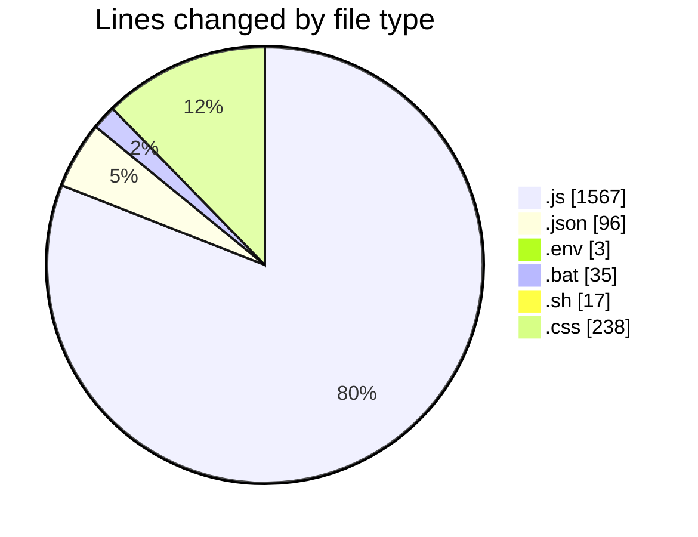

# eduWallet-main - Activity Summary 

## Overall Statistics

| Stat                   | Value                                                             |
| ---------------------- | ----------------------------------------------------------------- |
| **Lines Added** (➕)   | 1914                                          |
| **Lines Removed** (➖) | 42                                        |
| **Net Change** (↕)    | 1872                |
| **Active Time** (⌚)   | 39 minutes |

## Modified Files
- **database.js** (+31, -0)
- **User.js** (+51, -0)
- **LearnPass.js** (+74, -0)
- **Certificate.js** (+40, -0)
- **Badge.js** (+33, -0)
- **MarketplaceItem.js** (+41, -0)
- **importData.js** (+134, -0)
- **index.js** (+121, -0)
- **package.json** (+22, -0)
- **config.env** (+3, -0)
- **testConnection.js** (+21, -0)
- **Sidebar.js** (+511, -0)
- **ProfileLink.js** (+510, -0)
- **package.json** (+74, -0)
- **start-app.bat** (+18, -17)
- **start-app.sh** (+17, -0)
- **index.css** (+213, -25)

## Visualizations

### By File Type (Lines Changed)

### By Hour (Estimated Activity Count)

> **Last Updated:** 7/19/2025, 12:52:09 PM