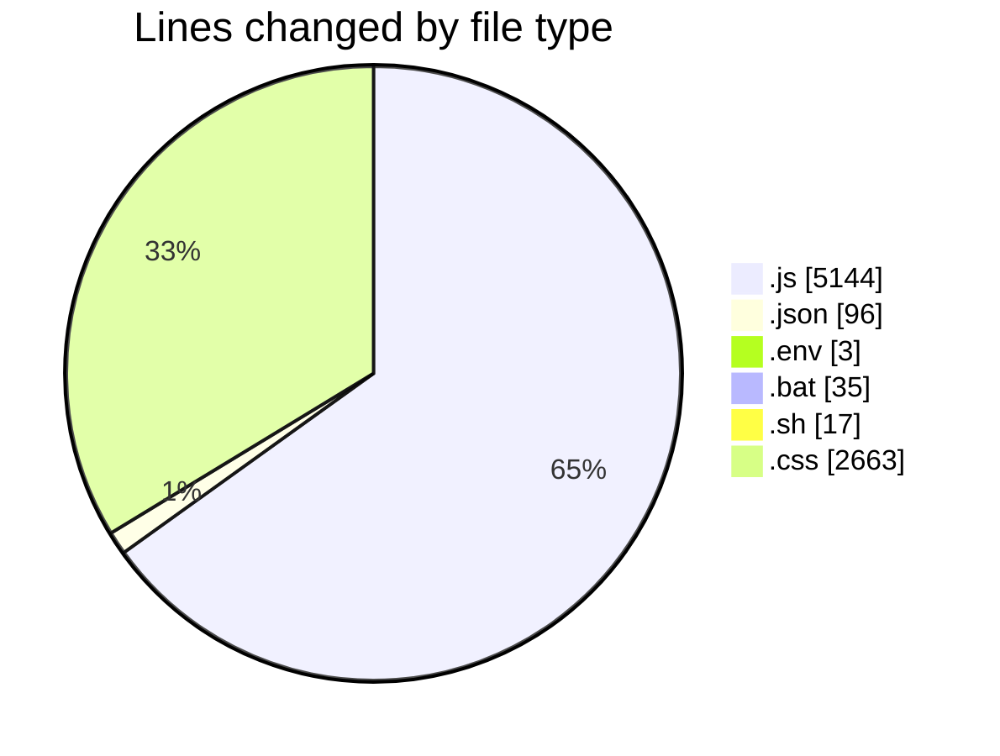
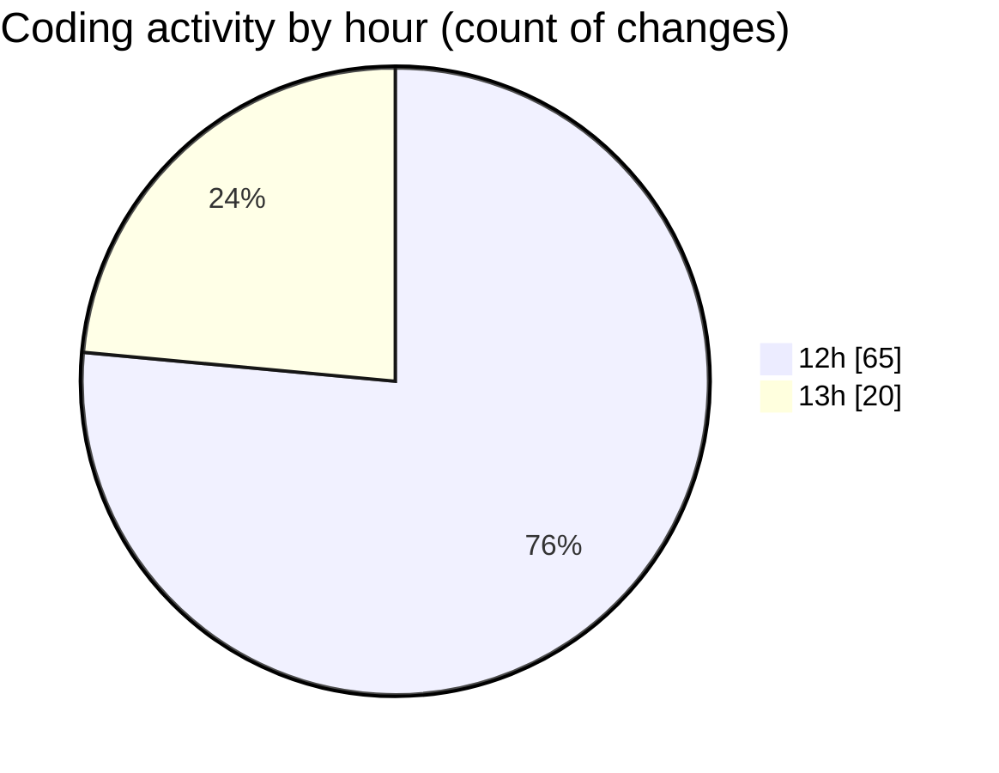

# eduWallet-main - Activity Summary 

## Overall Statistics

| Stat                   | Value                                                             |
| ---------------------- | ----------------------------------------------------------------- |
| **Lines Added** (➕)   | 6731                                          |
| **Lines Removed** (➖) | 1227                                        |
| **Net Change** (↕)    | 5504                |
| **Active Time** (⌚)   | 92 minutes |

## Modified Files
- **database.js** (+31, -0)
- **User.js** (+51, -0)
- **LearnPass.js** (+74, -0)
- **Certificate.js** (+40, -0)
- **Badge.js** (+33, -0)
- **MarketplaceItem.js** (+41, -0)
- **importData.js** (+134, -0)
- **index.js** (+121, -0)
- **package.json** (+22, -0)
- **config.env** (+3, -0)
- **testConnection.js** (+21, -0)
- **Sidebar.js** (+511, -320)
- **ProfileLink.js** (+510, -0)
- **package.json** (+74, -0)
- **start-app.bat** (+18, -17)
- **start-app.sh** (+17, -0)
- **index.css** (+213, -25)
- **Navbar.js** (+522, -306)
- **Dashboard.js** (+325, -138)
- **Home.js** (+169, -125)
- **Login.js** (+275, -142)
- **Register.js** (+325, -132)
- **LearnPass.js** (+169, -22)
- **Badges.js** (+196, -0)
- **Marketplace.js** (+179, -0)
- **Transfer.js** (+106, -0)
- **About.js** (+57, -0)
- **Footer.js** (+22, -0)
- **LoadingSpinner.js** (+47, -0)
- **Sidebar.css** (+357, -0)
- **Navbar.css** (+358, -0)
- **Dashboard.css** (+169, -0)
- **Home.css** (+147, -0)
- **Login.css** (+172, -0)
- **Register.css** (+182, -0)
- **LearnPass.css** (+245, -0)
- **Badges.css** (+299, -0)
- **Marketplace.css** (+279, -0)
- **Transfer.css** (+217, -0)

## Visualizations

### By File Type (Lines Changed)

### By Hour (Estimated Activity Count)

> **Last Updated:** 7/19/2025, 1:07:09 PM