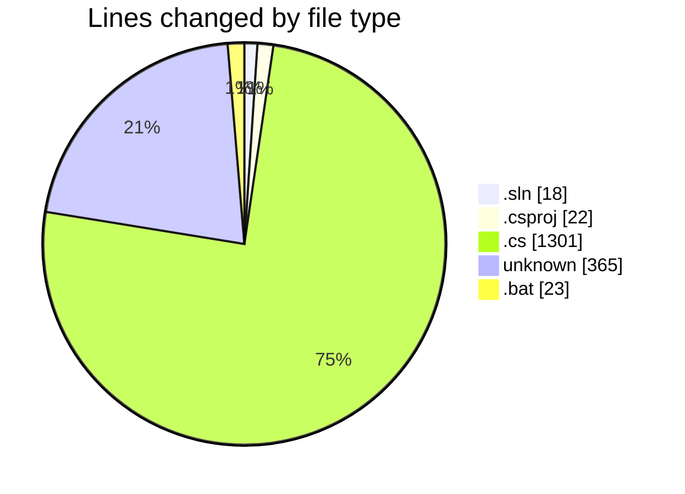
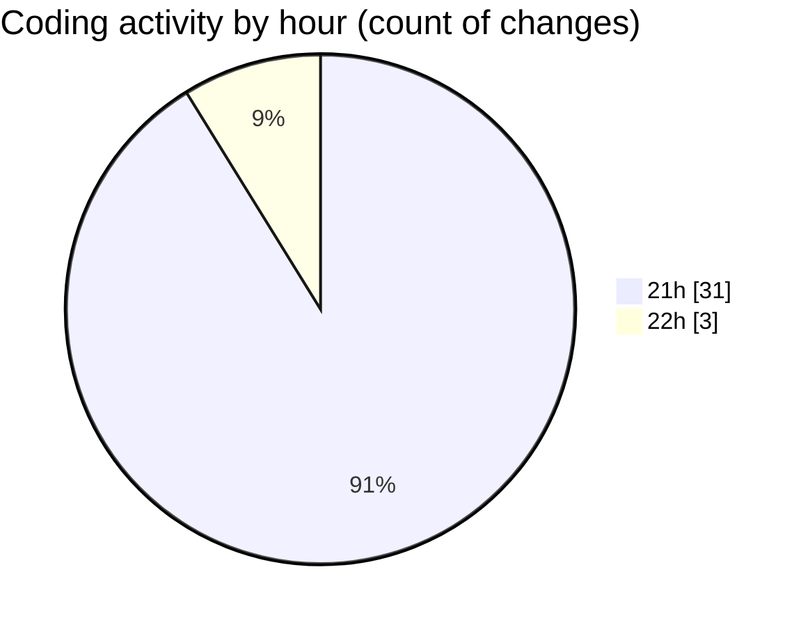

# regGarena - Activity Summary 

## Overall Statistics

| Stat                   | Value                                                             |
| ---------------------- | ----------------------------------------------------------------- |
| **Lines Added** (➕)   | 1650                                          |
| **Lines Removed** (➖) | 79                                        |
| **Net Change** (↕)    | 1571                |
| **Active Time** (⌚)   | 33 minutes |

## Modified Files
- **GarenaRegTool.sln** (+18, -0)
- **GarenaRegTool.csproj** (+19, -3)
- **Program.cs** (+20, -0)
- **Account.cs** (+43, -0)
- **GarenaService.cs** (+329, -75)
- **AccountGenerator.cs** (+101, -0)
- **MainForm.cs** (+488, -1)
- **MainForm.Designer.cs** (+39, -0)
- **.gitignore** (+365, -0)
- **build.bat** (+19, -0)
- **run.bat** (+4, -0)
- **AppSettings.cs** (+76, -0)
- **ExportService.cs** (+129, -0)

## Visualizations

### By File Type (Lines Changed)

### By Hour (Estimated Activity Count)

> **Last Updated:** 7/19/2025, 10:05:13 PM