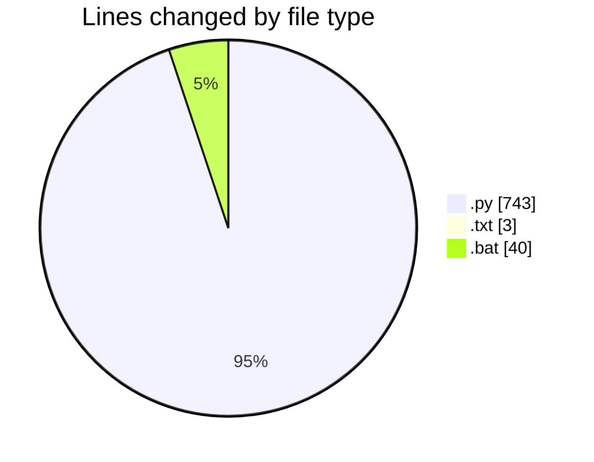

# reg - Activity Summary 

## Overall Statistics

| Stat                   | Value                                                             |
| ---------------------- | ----------------------------------------------------------------- |
| **Lines Added** (➕)   | 786                                          |
| **Lines Removed** (➖) | 0                                        |
| **Net Change** (↕)    | 786                |
| **Active Time** (⌚)   | 16 minutes |

## Modified Files
- **garena_reg_tool.py** (+328, -0)
- **requirements.txt** (+3, -0)
- **config.py** (+88, -0)
- **run_tool.bat** (+40, -0)
- **captcha_solver.py** (+327, -0)

## Visualizations

### By File Type (Lines Changed)

### By Hour (Estimated Activity Count)

> **Last Updated:** 7/20/2025, 11:48:25 PM