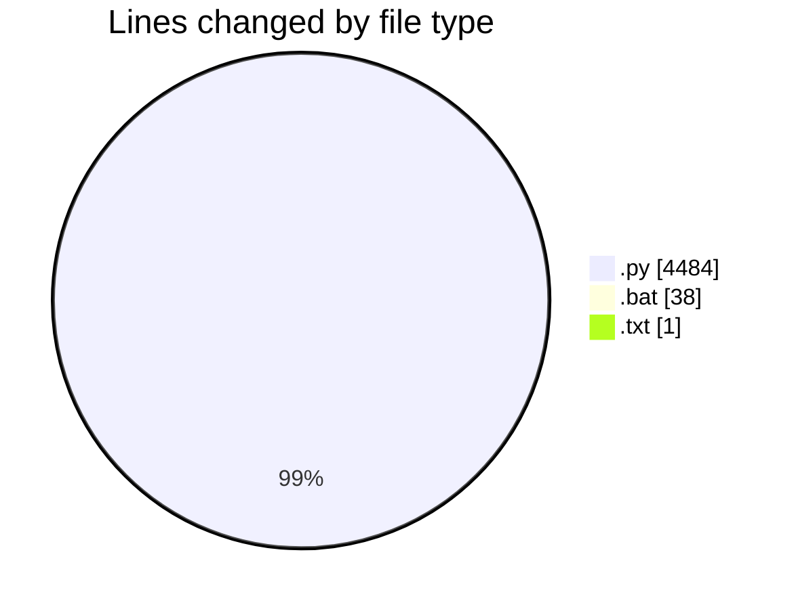
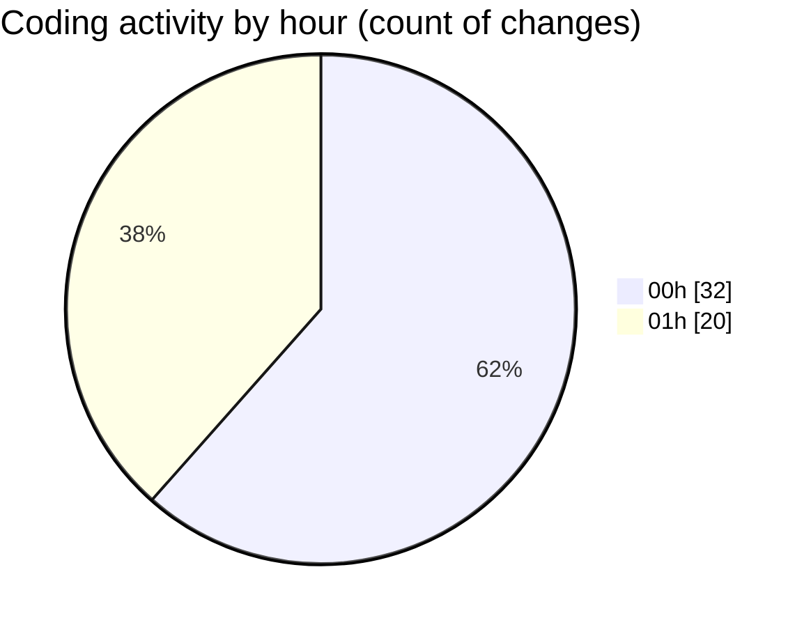

# reg - Activity Summary 

## Overall Statistics

| Stat                   | Value                                                             |
| ---------------------- | ----------------------------------------------------------------- |
| **Lines Added** (➕)   | 4478                                          |
| **Lines Removed** (➖) | 45                                        |
| **Net Change** (↕)    | 4433                |
| **Active Time** (⌚)   | 57 minutes |

## Modified Files
- **garena_reg_tool.py** (+108, -0)
- **garena_analyzer.py** (+245, -0)
- **test_garena_url.py** (+206, -0)
- **test_api_register.py** (+234, -0)
- **analyze_garena_api.py** (+251, -0)
- **simulate_garena_flow.py** (+305, -0)
- **reverse_engineer_garena.py** (+351, -0)
- **update_tool_params.py** (+226, -0)
- **garena_selenium_tool.py** (+519, -0)
- **setup_selenium.py** (+222, -45)
- **run_selenium_tool.bat** (+38, -0)
- **requirements.txt** (+1, -0)
- **garena_simple_selenium.py** (+485, -0)
- **test_register_urls.py** (+234, -0)
- **test_updated_tool.py** (+126, -0)
- **analyze_form_structure.py** (+212, -0)
- **email_otp_tool.py** (+489, -0)
- **test_email_otp.py** (+226, -0)

## Visualizations

### By File Type (Lines Changed)

### By Hour (Estimated Activity Count)

> **Last Updated:** 7/21/2025, 2:03:25 AM