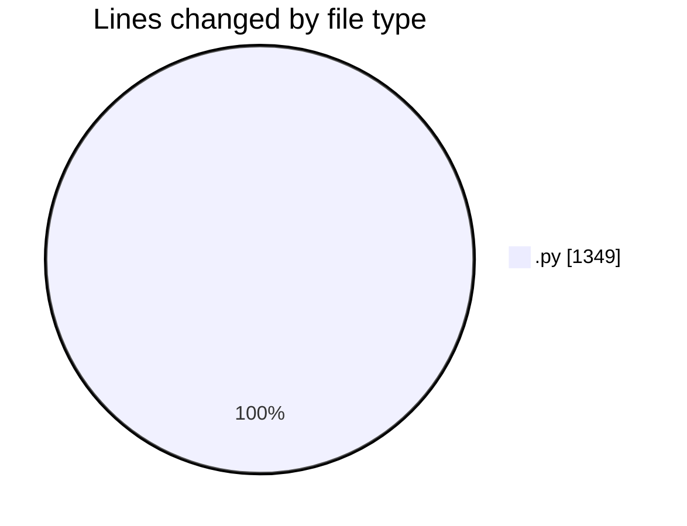
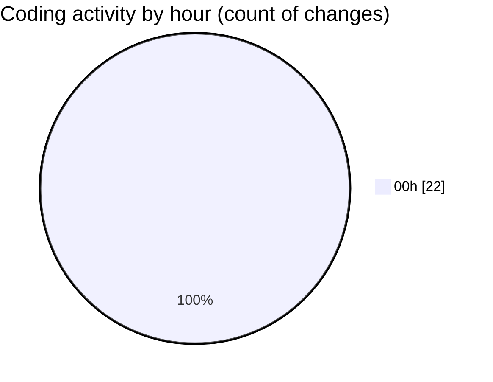

# reg - Activity Summary 

## Overall Statistics

| Stat                   | Value                                                             |
| ---------------------- | ----------------------------------------------------------------- |
| **Lines Added** (➕)   | 1349                                          |
| **Lines Removed** (➖) | 0                                        |
| **Net Change** (↕)    | 1349                |
| **Active Time** (⌚)   | 24 minutes |

## Modified Files
- **garena_reg_tool.py** (+108, -0)
- **garena_analyzer.py** (+245, -0)
- **test_garena_url.py** (+206, -0)
- **test_api_register.py** (+234, -0)
- **analyze_garena_api.py** (+251, -0)
- **simulate_garena_flow.py** (+305, -0)

## Visualizations

### By File Type (Lines Changed)

### By Hour (Estimated Activity Count)

> **Last Updated:** 7/21/2025, 12:33:25 AM