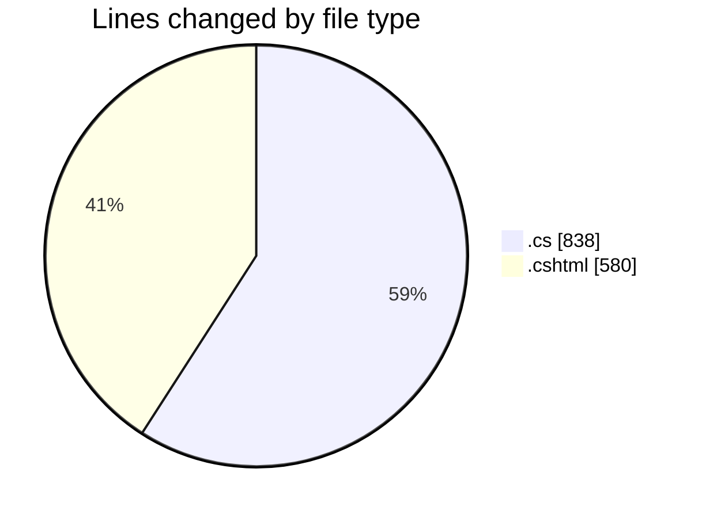
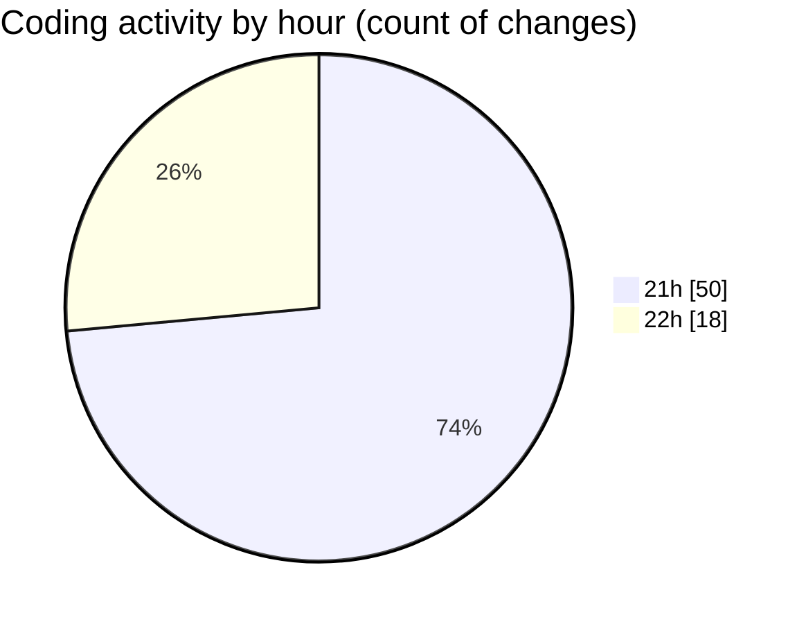

# nhaHang - Activity Summary 

## Overall Statistics

| Stat                   | Value                                                             |
| ---------------------- | ----------------------------------------------------------------- |
| **Lines Added** (➕)   | 1418                                          |
| **Lines Removed** (➖) | 0                                        |
| **Net Change** (↕)    | 1418                |
| **Active Time** (⌚)   | 74 minutes |

## Modified Files
- **AboutController.cs** (+12, -0)
- **Index.cshtml** (+174, -0)
- **ContactMessage.cs** (+25, -0)
- **News.cs** (+23, -0)
- **FAQ.cs** (+21, -0)
- **ApplicationDbContext.cs** (+69, -0)
- **ContactService.cs** (+41, -0)
- **NewsService.cs** (+47, -0)
- **FAQService.cs** (+47, -0)
- **Program.cs** (+149, -0)
- **AdminCustomersController.cs** (+92, -0)
- **Index.cshtml** (+37, -0)
- **Details.cshtml** (+25, -0)
- **Create.cshtml** (+39, -0)
- **Edit.cshtml** (+35, -0)
- **Delete.cshtml** (+19, -0)
- **ContactController.cs** (+40, -0)
- **AdminContactController.cs** (+48, -0)
- **Index.cshtml** (+23, -0)
- **ThankYou.cshtml** (+8, -0)
- **Index.cshtml** (+29, -0)
- **Details.cshtml** (+20, -0)
- **Delete.cshtml** (+19, -0)
- **NewsController.cs** (+31, -0)
- **AdminNewsController.cs** (+89, -0)
- **Index.cshtml** (+24, -0)
- **Details.cshtml** (+16, -0)
- **Index.cshtml** (+29, -0)
- **Create.cshtml** (+24, -0)
- **Edit.cshtml** (+25, -0)
- **Delete.cshtml** (+17, -0)
- **Details.cshtml** (+17, -0)
- **FAQController.cs** (+23, -0)
- **AdminFAQController.cs** (+81, -0)

## Visualizations

### By File Type (Lines Changed)

### By Hour (Estimated Activity Count)

> **Last Updated:** 7/22/2025, 10:09:19 PM