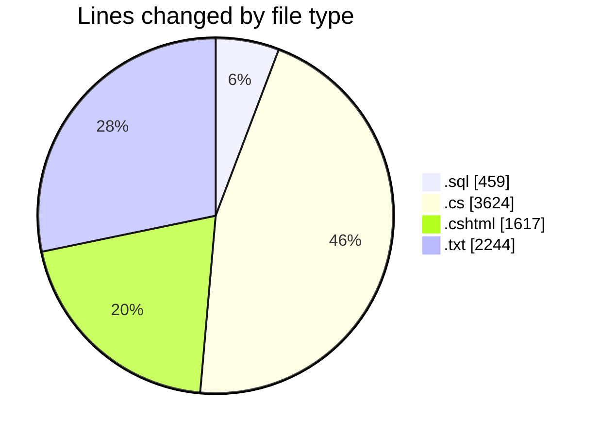
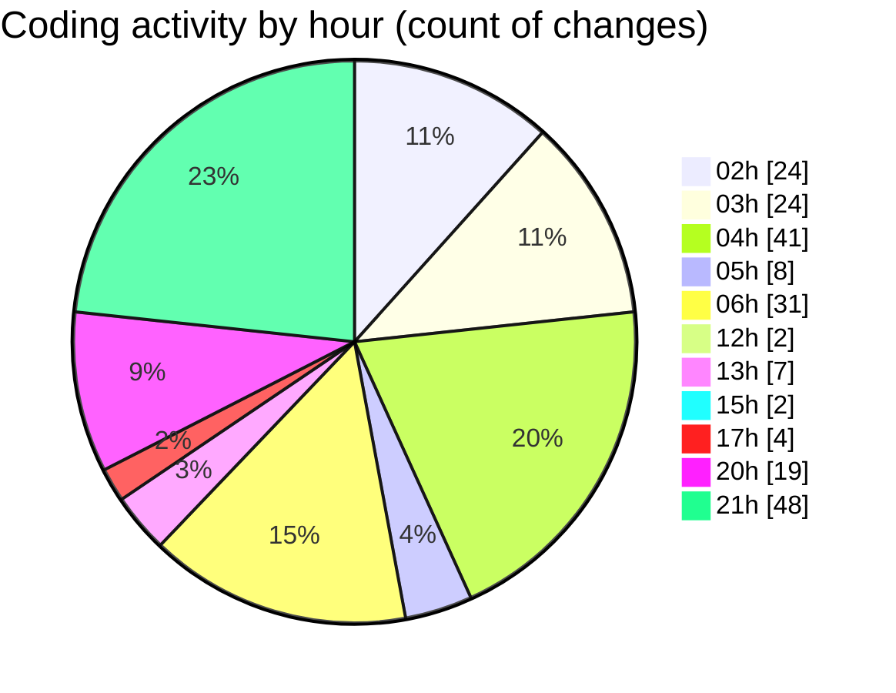

# quanlyRapChieuPhim - Activity Summary 

## Overall Statistics

| Stat                   | Value                                                             |
| ---------------------- | ----------------------------------------------------------------- |
| **Lines Added** (➕)   | 6874                                          |
| **Lines Removed** (➖) | 1070                                        |
| **Net Change** (↕)    | 5804                |
| **Active Time** (⌚)   | 297 minutes |

## Modified Files
- **SQLrapphim.sql** (+433, -26)
- **KhachHangController.cs** (+3231, -85)
- **HoaDon.cs** (+41, -0)
- **TempGioHangItem.cs** (+41, -0)
- **CinemaDbContext.cs** (+76, -0)
- **HuongDanChuyenKhoanViewModel.cs** (+8, -0)
- **Index.cshtml** (+770, -0)
- **error_log.txt** (+1318, -926)
- **CTHD.cs** (+31, -0)
- **HDVoucher.cs** (+29, -0)
- **HuongDanChuyenKhoan.cshtml** (+168, -9)
- **LichSuDatVe.cshtml** (+200, -0)
- **KhachHangViewModels.cs** (+82, -0)
- **ThanhToan.cshtml** (+446, -24)

## Visualizations

### By File Type (Lines Changed)

### By Hour (Estimated Activity Count)

> **Last Updated:** 7/23/2025, 9:53:09 PM