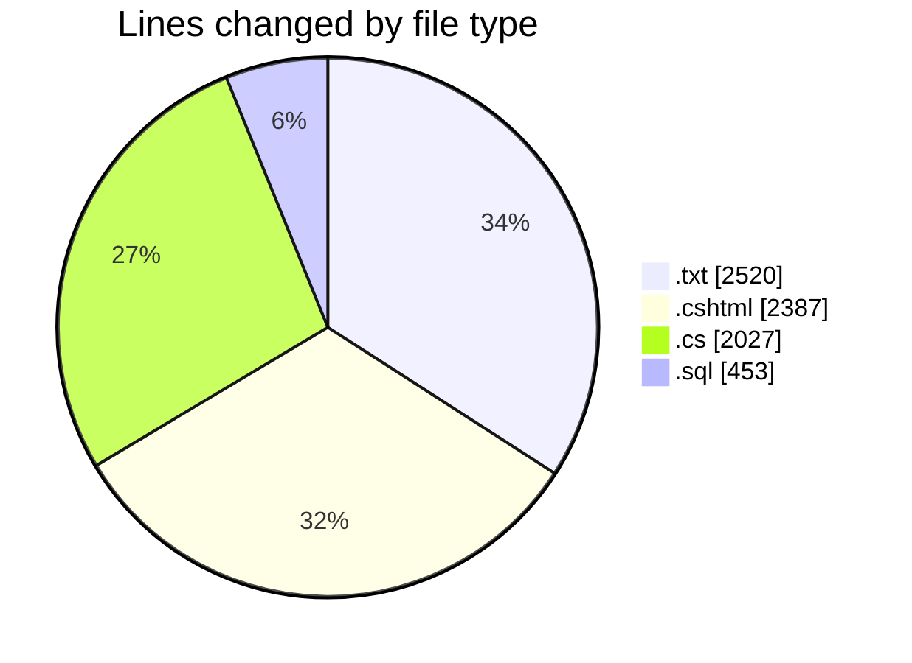
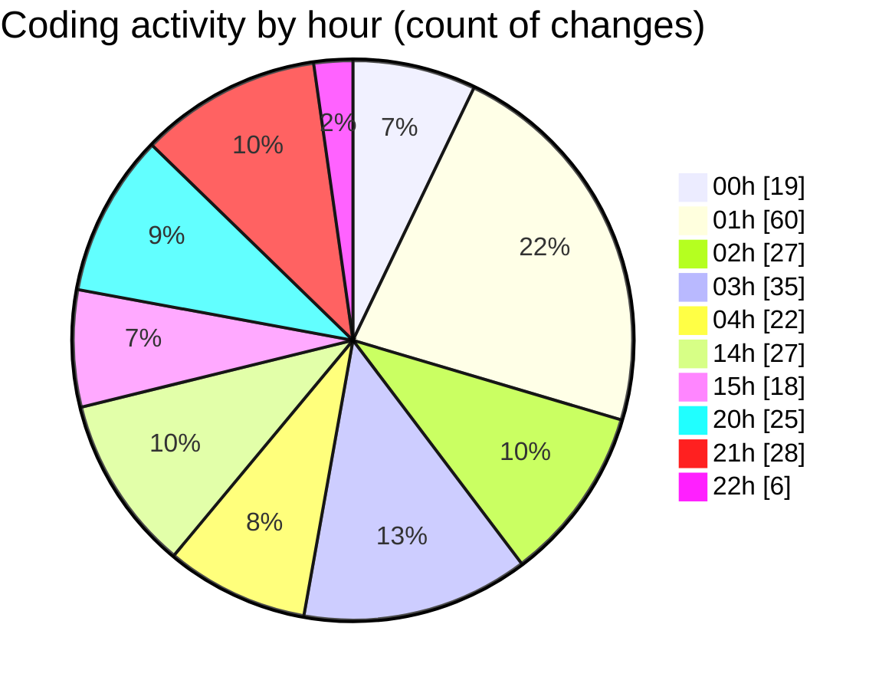

# quanlyRapChieuPhim-1 - Activity Summary 

## Overall Statistics

| Stat                   | Value                                                             |
| ---------------------- | ----------------------------------------------------------------- |
| **Lines Added** (➕)   | 6161                                          |
| **Lines Removed** (➖) | 1226                                        |
| **Net Change** (↕)    | 4935                |
| **Active Time** (⌚)   | 357 minutes |

## Modified Files
- **error_log.txt** (+1354, -1166)
- **ThanhToan.cshtml** (+331, -3)
- **KhachHangController.cs** (+1331, -8)
- **ChonGhe.cshtml** (+1840, -13)
- **sql.sql** (+453, -0)
- **CronController.cs** (+179, -10)
- **LichSuDatVe.cshtml** (+200, -0)
- **Ve.cs** (+57, -0)
- **HoaDon.cs** (+41, -3)
- **CTHD.cs** (+31, -0)
- **Phim.cs** (+39, -0)
- **LichChieu.cs** (+43, -5)
- **PhongChieu.cs** (+34, -0)
- **NhanVien.cs** (+32, -0)
- **GheNgoi.cs** (+33, -0)
- **Voucher.cs** (+33, -0)
- **KhachHang.cs** (+25, -0)
- **TaiKhoan.cs** (+35, -0)
- **TempGioHangItem.cs** (+41, -16)
- **HDVoucher.cs** (+29, -2)

## Visualizations

### By File Type (Lines Changed)

### By Hour (Estimated Activity Count)

> **Last Updated:** 7/25/2025, 10:05:48 PM