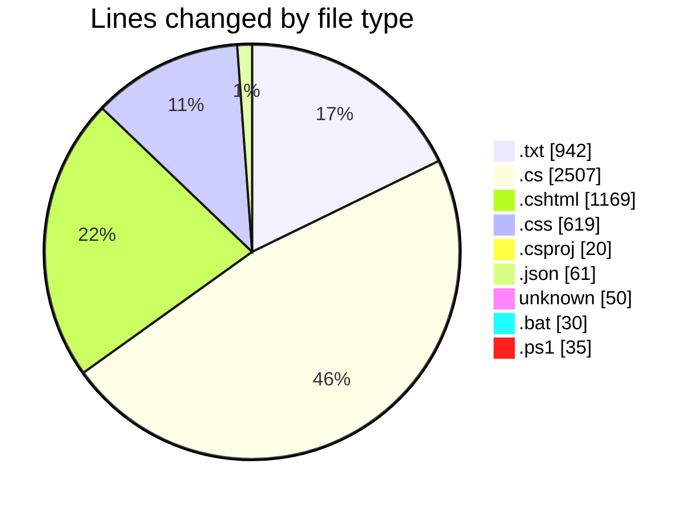
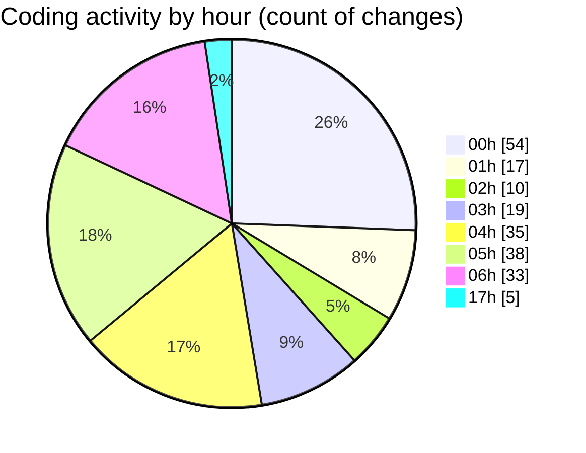

# quanlyRapChieuPhim-1 - Activity Summary 

## Overall Statistics

| Stat                   | Value                                                             |
| ---------------------- | ----------------------------------------------------------------- |
| **Lines Added** (➕)   | 4107                                          |
| **Lines Removed** (➖) | 1326                                        |
| **Net Change** (↕)    | 2781                |
| **Active Time** (⌚)   | 272 minutes |

## Modified Files
- **error_log.txt** (+474, -468)
- **KhachHangController.cs** (+103, -23)
- **KhachHangViewModels.cs** (+1, -0)
- **ThanhToan.cshtml** (+106, -13)
- **CronController.cs** (+7, -4)
- **BanVeController.cs** (+682, -0)
- **LichSuDatVe.cshtml** (+389, -294)
- **thanh-toan-custom.css** (+619, -0)
- **CinemaManagement.csproj** (+20, -0)
- **appsettings.json** (+19, -0)
- **Program.cs** (+314, -71)
- **AuthController.cs** (+849, -453)
- **Login.cshtml** (+367, -0)
- **.gitignore** (+50, -0)
- **appsettings.Development.json** (+18, -0)
- **run-app.bat** (+30, -0)
- **run-app.ps1** (+35, -0)
- **launchSettings.json** (+24, -0)

## Visualizations

### By File Type (Lines Changed)

### By Hour (Estimated Activity Count)

> **Last Updated:** 7/26/2025, 5:33:35 PM