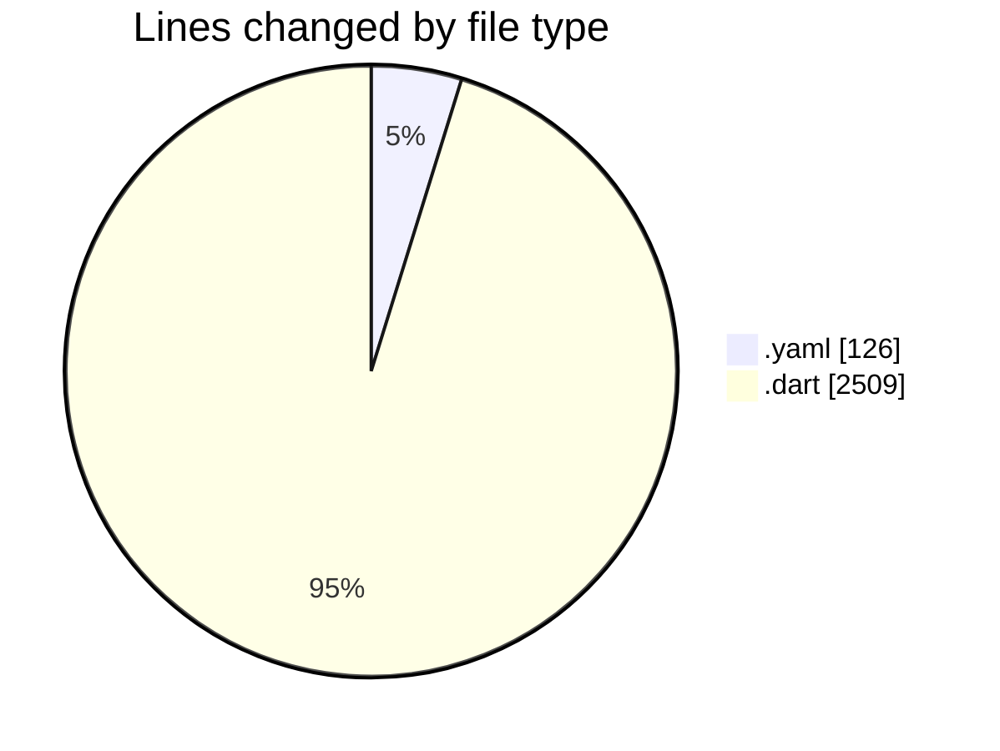
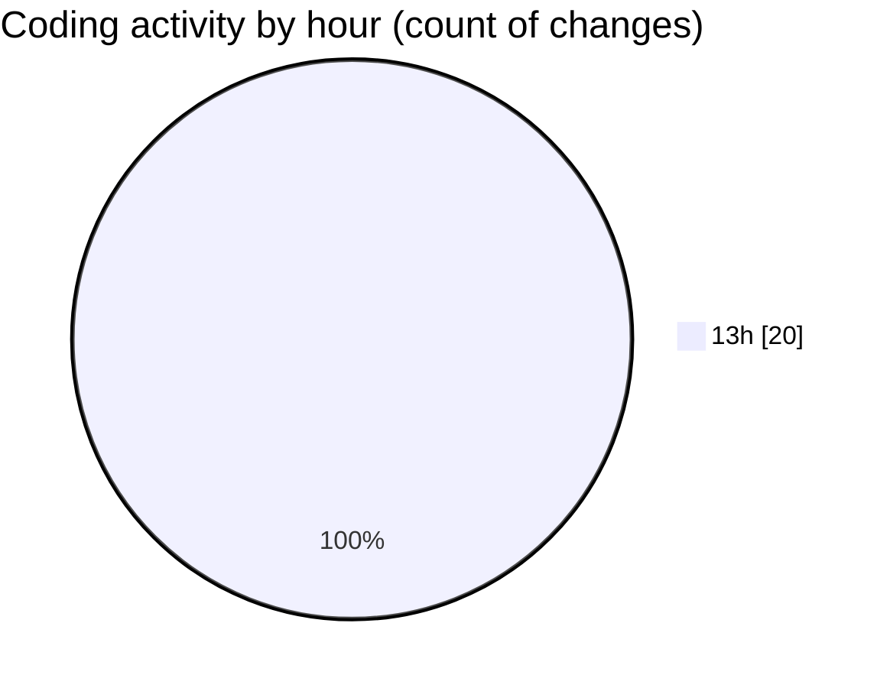

# appProject - Activity Summary 

## Overall Statistics

| Stat                   | Value                                                             |
| ---------------------- | ----------------------------------------------------------------- |
| **Lines Added** (➕)   | 2635                                          |
| **Lines Removed** (➖) | 0                                        |
| **Net Change** (↕)    | 2635                |
| **Active Time** (⌚)   | 20 minutes |

## Modified Files
- **pubspec.yaml** (+126, -0)
- **main.dart** (+88, -0)
- **app_colors.dart** (+165, -0)
- **app_routes.dart** (+231, -0)
- **splash_screen.dart** (+203, -0)
- **onboarding_screen.dart** (+233, -0)
- **login_screen.dart** (+324, -0)
- **register_screen.dart** (+355, -0)
- **forgot_password_screen.dart** (+257, -0)
- **dashboard_screen.dart** (+653, -0)

## Visualizations

### By File Type (Lines Changed)

### By Hour (Estimated Activity Count)

> **Last Updated:** 7/27/2025, 1:24:41 PM