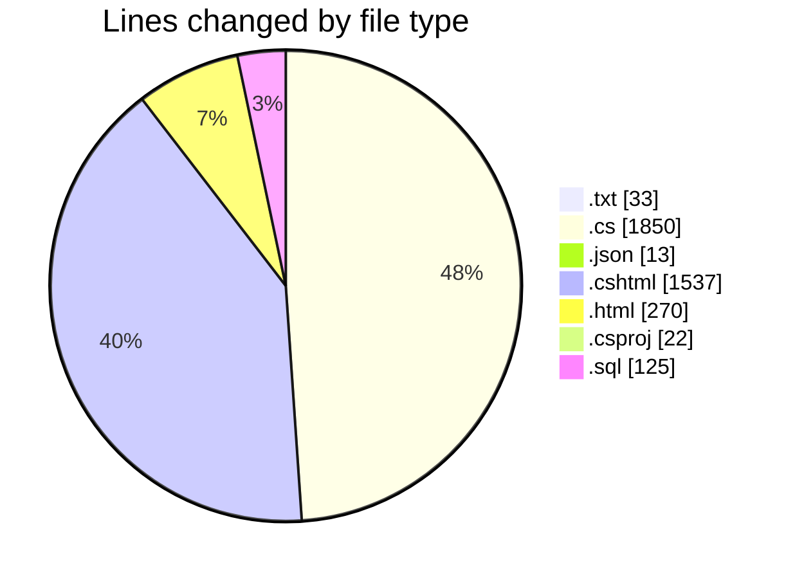
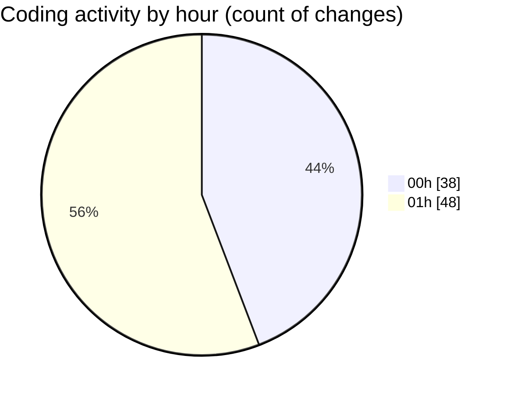

# quanlyRapChieuPhim-1 - Activity Summary 

## Overall Statistics

| Stat                   | Value                                                             |
| ---------------------- | ----------------------------------------------------------------- |
| **Lines Added** (➕)   | 3783                                          |
| **Lines Removed** (➖) | 67                                        |
| **Net Change** (↕)    | 3716                |
| **Active Time** (⌚)   | 104 minutes |

## Modified Files
- **error_log.txt** (+19, -14)
- **Program.cs** (+16, -8)
- **appsettings.json** (+11, -2)
- **ResetPasswordModel.cs** (+37, -0)
- **EmailService.cs** (+817, -37)
- **PasswordResetService.cs** (+134, -0)
- **AuthController.cs** (+486, -0)
- **ForgotPassword.cshtml** (+84, -0)
- **ResetPassword.cshtml** (+185, -0)
- **Login.cshtml** (+372, -0)
- **Email_Templates_Demo.html** (+270, -0)
- **TaiKhoan.cs** (+48, -0)
- **TwoFactorService.cs** (+207, -6)
- **CinemaManagement.csproj** (+22, -0)
- **TwoFactorViewModels.cs** (+54, -0)
- **TwoFactorSetup.cshtml** (+154, -0)
- **TwoFactorVerify.cshtml** (+176, -0)
- **TwoFactorStatus.cshtml** (+210, -0)
- **TwoFactorDisable.cshtml** (+119, -0)
- **TwoFactorBackupCodes.cshtml** (+237, -0)
- **database_2fa_migration.sql** (+125, -0)

## Visualizations

### By File Type (Lines Changed)

### By Hour (Estimated Activity Count)

> **Last Updated:** 7/27/2025, 1:43:36 AM