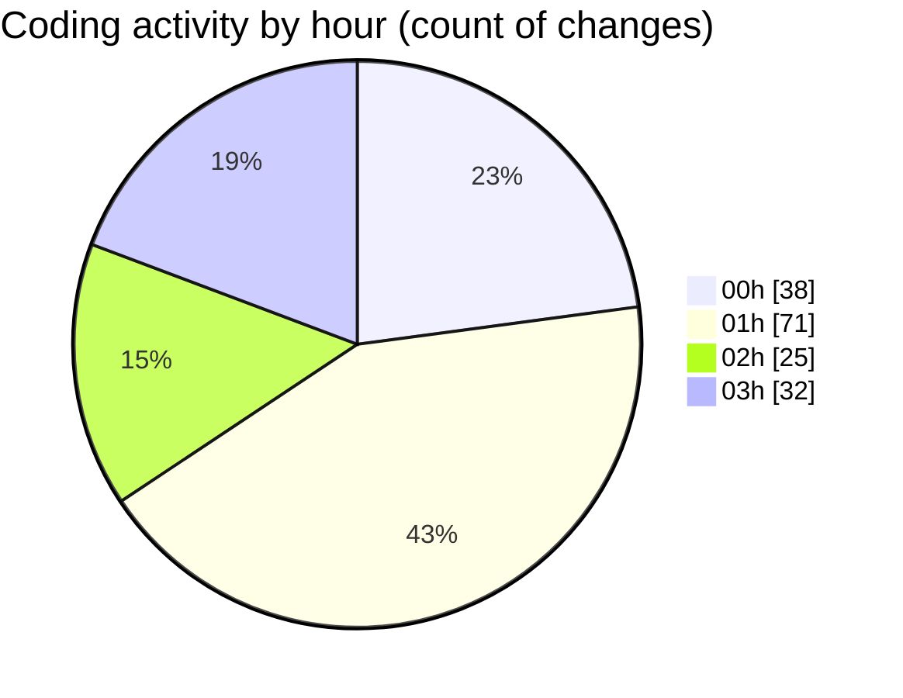

# quanlyRapChieuPhim-1 - Activity Summary 

## Overall Statistics

| Stat                   | Value                                                             |
| ---------------------- | ----------------------------------------------------------------- |
| **Lines Added** (➕)   | 9379                                          |
| **Lines Removed** (➖) | 796                                        |
| **Net Change** (↕)    | 8583                |
| **Active Time** (⌚)   | 195 minutes |

## Modified Files
- **error_log.txt** (+44, -14)
- **Program.cs** (+20, -12)
- **appsettings.json** (+11, -2)
- **ResetPasswordModel.cs** (+37, -0)
- **EmailService.cs** (+817, -37)
- **PasswordResetService.cs** (+134, -0)
- **AuthController.cs** (+487, -48)
- **ForgotPassword.cshtml** (+84, -0)
- **ResetPassword.cshtml** (+185, -0)
- **Login.cshtml** (+372, -0)
- **Email_Templates_Demo.html** (+270, -0)
- **TaiKhoan.cs** (+48, -1)
- **TwoFactorService.cs** (+207, -33)
- **CinemaManagement.csproj** (+22, -0)
- **TwoFactorViewModels.cs** (+55, -1)
- **TwoFactorSetup.cshtml** (+154, -27)
- **TwoFactorVerify.cshtml** (+176, -11)
- **TwoFactorStatus.cshtml** (+210, -41)
- **TwoFactorDisable.cshtml** (+119, -0)
- **TwoFactorBackupCodes.cshtml** (+237, -0)
- **database_2fa_migration.sql** (+241, -240)
- **run_database_migration.bat** (+58, -0)
- **run_database_migration.ps1** (+76, -0)
- **run_migration.bat** (+58, -0)
- **2FA_Migration_Simple.sql** (+48, -0)
- **_Layout.cshtml** (+239, -0)
- **Index.cshtml** (+1002, -0)
- **LichSuDatVe.cshtml** (+295, -0)
- **ChonGhe.cshtml** (+924, -0)
- **KhachHangController.cs** (+1443, -0)
- **ChiTietPhim.cshtml** (+870, -329)
- **chi-tiet-phim.css** (+327, -0)
- **KhachHangViewModels.cs** (+109, -0)

## Visualizations

### By File Type (Lines Changed)

### By Hour (Estimated Activity Count)

> **Last Updated:** 7/27/2025, 3:48:36 AM