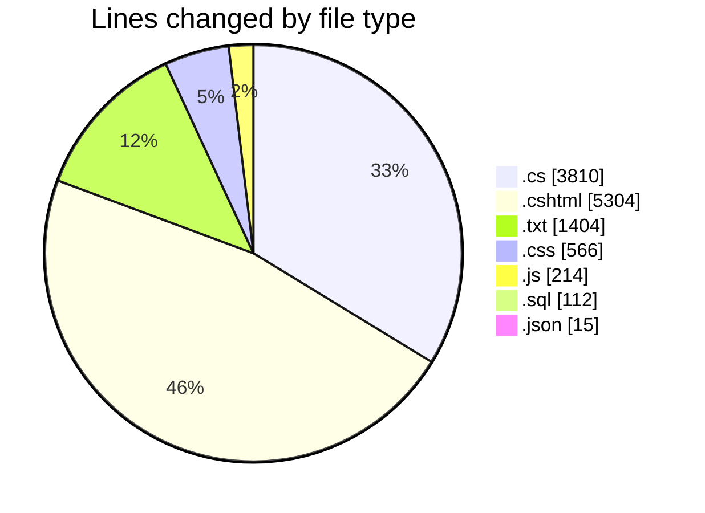
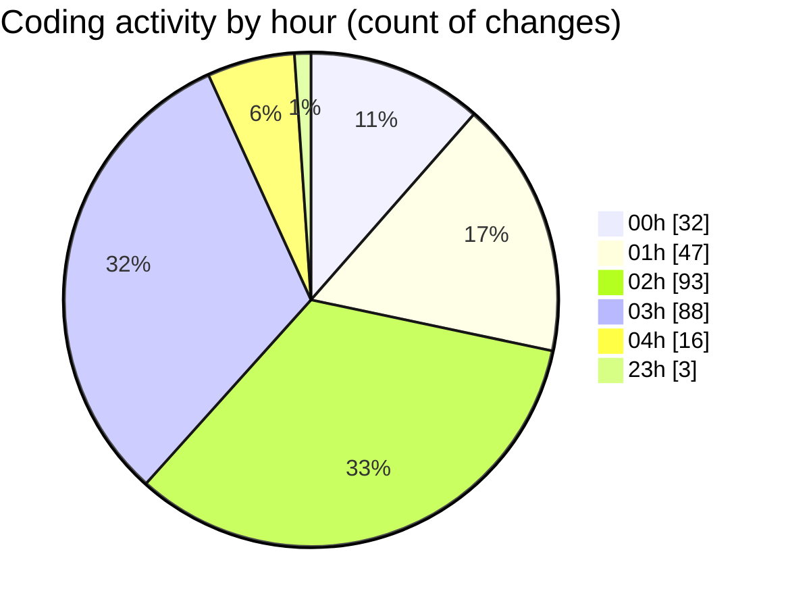

# quanlyRapChieuPhim-1 - Activity Summary 

## Overall Statistics

| Stat                   | Value                                                             |
| ---------------------- | ----------------------------------------------------------------- |
| **Lines Added** (➕)   | 10481                                          |
| **Lines Removed** (➖) | 944                                        |
| **Net Change** (↕)    | 9537                |
| **Active Time** (⌚)   | 320 minutes |

## Modified Files
- **DanhGiaViewModels.cs** (+49, -0)
- **HoaDon.cshtml** (+391, -0)
- **QuanLyNhanVien.cshtml** (+155, -0)
- **TaiKhoan.cshtml** (+234, -0)
- **ThanhToanThanhCong.cshtml** (+494, -0)
- **QuanLyController.cs** (+515, -0)
- **Create.cshtml** (+159, -68)
- **Edit.cshtml** (+160, -59)
- **AuthController.cs** (+884, -0)
- **KhachHangController.cs** (+1615, -12)
- **ChatController.cs** (+115, -4)
- **HomeController.cs** (+58, -0)
- **error_log.txt** (+671, -733)
- **ScheduleDto.cs** (+30, -0)
- **DanhGiaController.cs** (+344, -0)
- **chi-tiet-phim.css** (+531, -35)
- **site.js** (+214, -0)
- **_Layout.cshtml** (+240, -0)
- **ChiTietPhim.cshtml** (+594, -0)
- **Index.cshtml** (+1496, -0)
- **_ScheduleForDate.cshtml** (+103, -0)
- **ChonGhe.cshtml** (+924, -0)
- **CinemaDbContext.cs** (+17, -29)
- **chat_tables_fixed.sql** (+19, -0)
- **ChatHub.cs** (+134, -0)
- **ChatMessage.cs** (+0, -2)
- **ChatRoom.cs** (+0, -2)
- **appsettings.json** (+15, -0)
- **TestConnection.cshtml** (+227, -0)
- **create_chat_tables.sql** (+93, -0)

## Visualizations

### By File Type (Lines Changed)

### By Hour (Estimated Activity Count)

> **Last Updated:** 7/28/2025, 4:28:23 AM