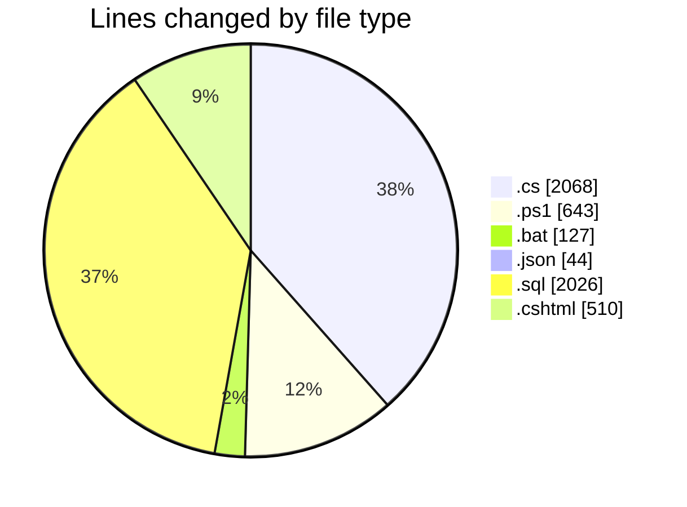
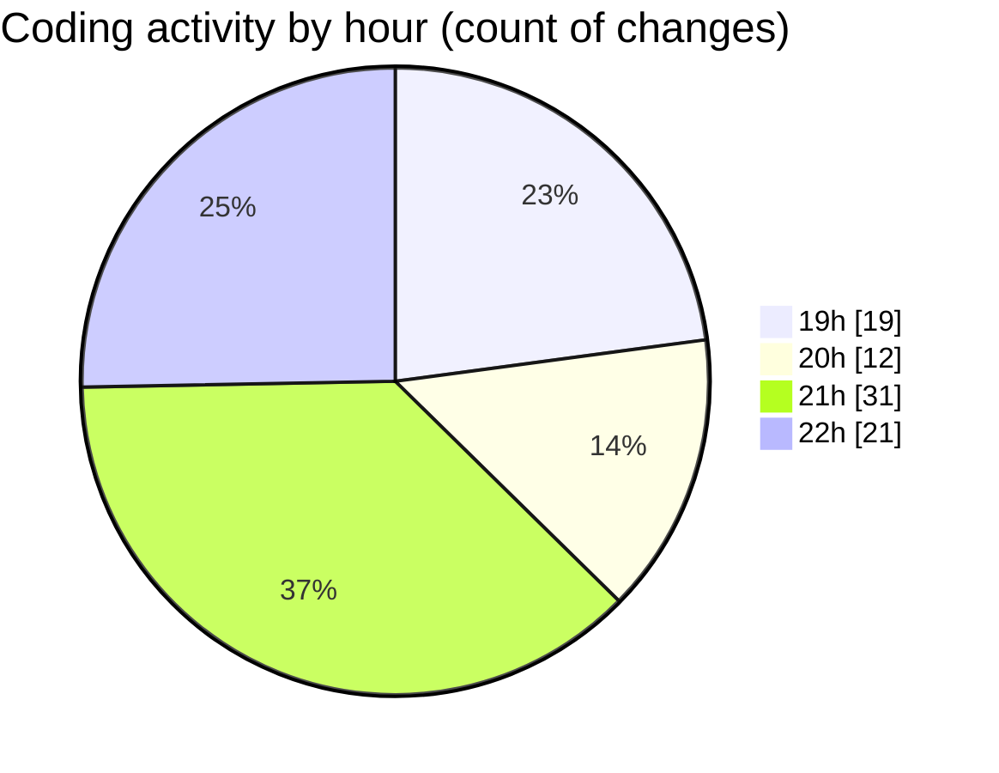

# quanlyRapChieuPhim-2 - Activity Summary 

## Overall Statistics

| Stat                   | Value                                                             |
| ---------------------- | ----------------------------------------------------------------- |
| **Lines Added** (➕)   | 4866                                          |
| **Lines Removed** (➖) | 552                                        |
| **Net Change** (↕)    | 4314                |
| **Active Time** (⌚)   | 115 minutes |

## Modified Files
- **CronController.cs** (+387, -223)
- **BankingService.cs** (+250, -0)
- **Program.cs** (+282, -0)
- **run-banking-cron.ps1** (+91, -0)
- **start-app.ps1** (+231, -230)
- **start-app.bat** (+37, -18)
- **run-banking-cron.ps1** (+91, -0)
- **run-banking-cron.bat** (+41, -0)
- **BankingService.cs** (+264, -0)
- **auto-cancel-seats.bat** (+31, -0)
- **appsettings.json** (+43, -1)
- **add_godfather_schedules.sql** (+128, -0)
- **delete_tickets_by_time.sql** (+146, -0)
- **check_and_delete_lc236.sql** (+141, -1)
- **add_godfather_late_shows.sql** (+174, -8)
- **debug_godfather_tickets.sql** (+84, -0)
- **update_lc236_and_clean_data.sql** (+133, -0)
- **fix_lc236_null_values.sql** (+160, -0)
- **fix_all_null_values.sql** (+285, -0)
- **fix_datetime_null_values.sql** (+298, -33)
- **add_godfather_2hour_shows.sql** (+190, -38)
- **fix_godfather_ticket_price.sql** (+101, -0)
- **check_godfather_rooms.sql** (+95, -0)
- **QuanLyController.cs** (+662, -0)
- **QuanLyLichChieu.cshtml** (+510, -0)
- **check_data.sql** (+11, -0)

## Visualizations

### By File Type (Lines Changed)

### By Hour (Estimated Activity Count)

> **Last Updated:** 7/28/2025, 10:30:39 PM