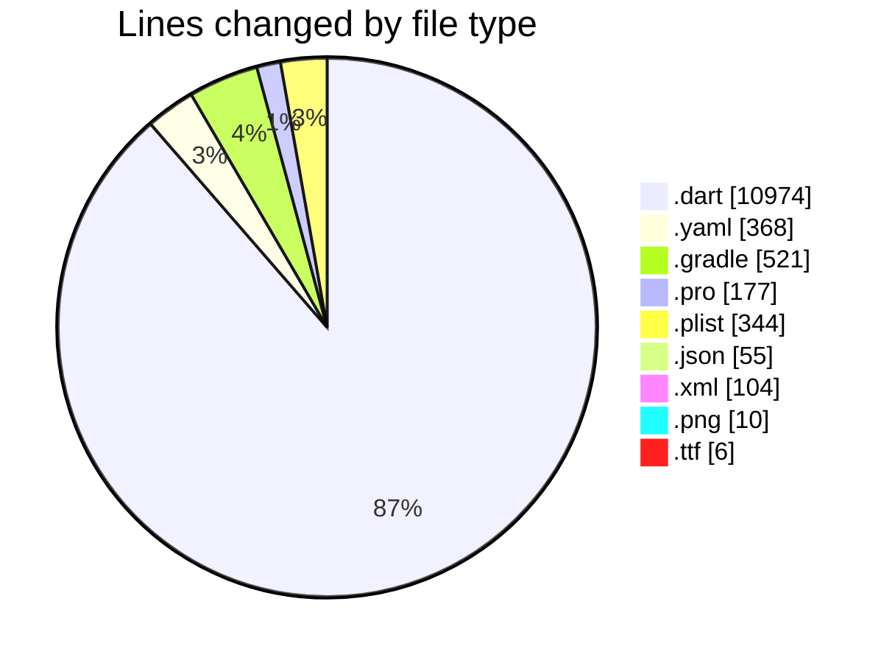
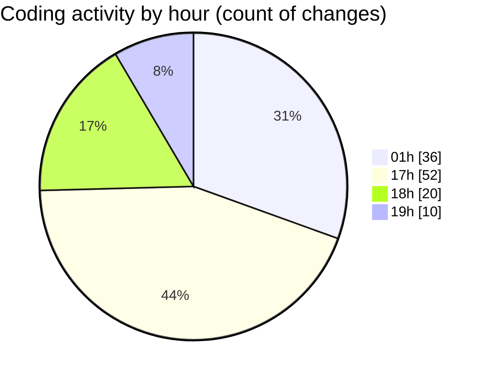

# appProject - Activity Summary 

## Overall Statistics

| Stat                   | Value                                                             |
| ---------------------- | ----------------------------------------------------------------- |
| **Lines Added** (➕)   | 11864                                          |
| **Lines Removed** (➖) | 695                                        |
| **Net Change** (↕)    | 11169                |
| **Active Time** (⌚)   | 141 minutes |

## Modified Files
- **sync_service.dart** (+169, -0)
- **local_database.dart** (+323, -0)
- **task_repository.dart** (+264, -0)
- **task.dart** (+225, -0)
- **task_provider.dart** (+340, -0)
- **main.dart** (+521, -180)
- **sync_status_widget.dart** (+243, -0)
- **connectivity_service.dart** (+90, -0)
- **app_config.dart** (+394, -49)
- **logger_service.dart** (+167, -0)
- **performance_service.dart** (+214, -0)
- **validation_utils.dart** (+279, -0)
- **error_handler_service.dart** (+302, -0)
- **analytics_service.dart** (+323, -0)
- **pubspec.yaml** (+262, -106)
- **build.gradle** (+416, -72)
- **proguard-rules.pro** (+177, -0)
- **Info.plist** (+302, -0)
- **firebase_service.dart** (+253, -0)
- **google-services.json** (+47, -8)
- **GoogleService-Info.plist** (+36, -6)
- **build.gradle** (+33, -0)
- **AndroidManifest.xml** (+90, -0)
- **colors.xml** (+4, -0)
- **ic_notification.xml** (+10, -0)
- **app_icon.png** (+2, -0)
- **splash_logo.png** (+2, -0)
- **branding.png** (+2, -0)
- **splash_logo_dark.png** (+2, -0)
- **branding_dark.png** (+2, -0)
- **Roboto-Regular.ttf** (+2, -0)
- **Roboto-Bold.ttf** (+2, -0)
- **Roboto-Light.ttf** (+2, -0)
- **splash_screen.dart** (+155, -0)
- **onboarding_screen.dart** (+233, -1)
- **login_screen.dart** (+497, -0)
- **dashboard_screen.dart** (+1100, -267)
- **register_screen.dart** (+547, -5)
- **tasks_screen.dart** (+708, -0)
- **calendar_screen.dart** (+684, -0)
- **profile_screen.dart** (+972, -1)
- **user_model.dart** (+171, -0)
- **user_repository.dart** (+518, -0)
- **user_management_screen.dart** (+779, -0)

## Visualizations

### By File Type (Lines Changed)

### By Hour (Estimated Activity Count)

> **Last Updated:** 7/29/2025, 7:50:48 PM