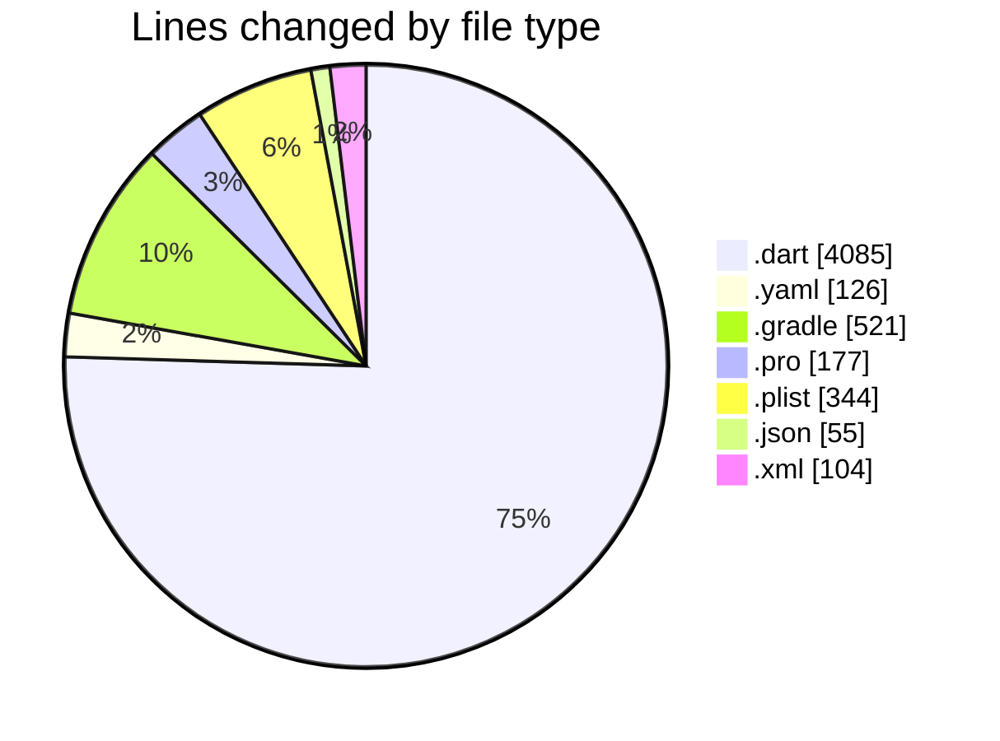
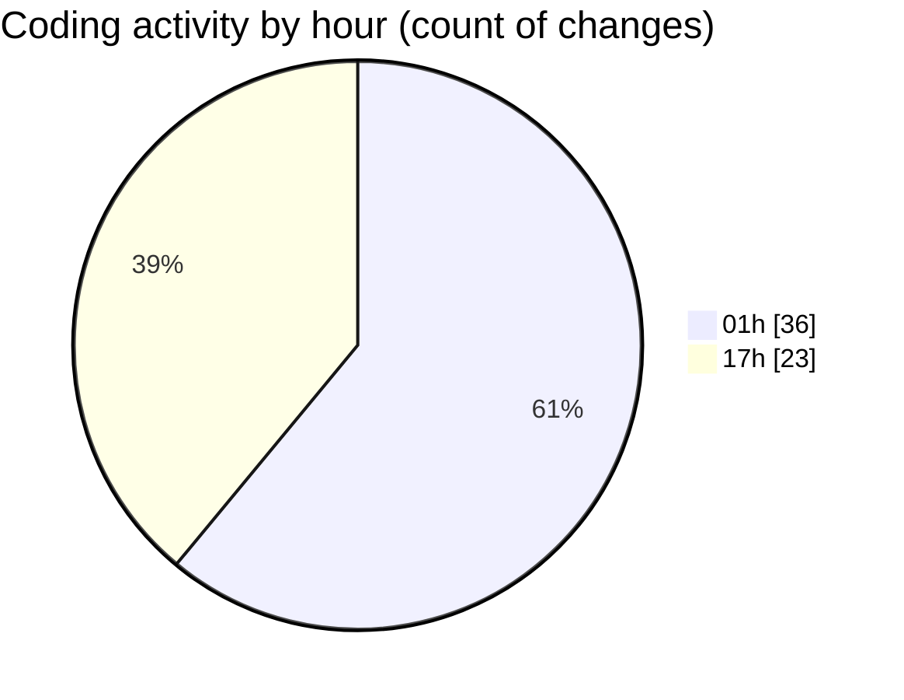

# appProject - Activity Summary 

## Overall Statistics

| Stat                   | Value                                                             |
| ---------------------- | ----------------------------------------------------------------- |
| **Lines Added** (➕)   | 5299                                          |
| **Lines Removed** (➖) | 113                                        |
| **Net Change** (↕)    | 5186                |
| **Active Time** (⌚)   | 65 minutes |

## Modified Files
- **sync_service.dart** (+169, -0)
- **local_database.dart** (+323, -0)
- **task_repository.dart** (+264, -0)
- **task.dart** (+225, -0)
- **task_provider.dart** (+340, -0)
- **main.dart** (+518, -23)
- **sync_status_widget.dart** (+243, -0)
- **connectivity_service.dart** (+90, -0)
- **app_config.dart** (+348, -4)
- **logger_service.dart** (+167, -0)
- **performance_service.dart** (+214, -0)
- **validation_utils.dart** (+279, -0)
- **error_handler_service.dart** (+302, -0)
- **analytics_service.dart** (+323, -0)
- **pubspec.yaml** (+126, -0)
- **build.gradle** (+416, -72)
- **proguard-rules.pro** (+177, -0)
- **Info.plist** (+302, -0)
- **firebase_service.dart** (+253, -0)
- **google-services.json** (+47, -8)
- **GoogleService-Info.plist** (+36, -6)
- **build.gradle** (+33, -0)
- **AndroidManifest.xml** (+90, -0)
- **colors.xml** (+4, -0)
- **ic_notification.xml** (+10, -0)

## Visualizations

### By File Type (Lines Changed)

### By Hour (Estimated Activity Count)

> **Last Updated:** 7/29/2025, 5:25:48 PM