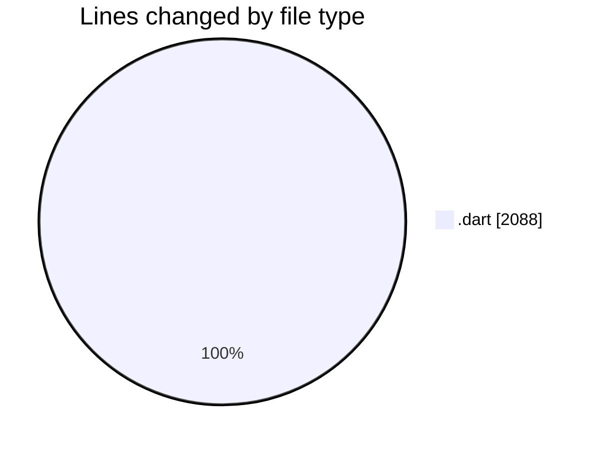

# appProject - Activity Summary 

## Overall Statistics

| Stat                   | Value                                                             |
| ---------------------- | ----------------------------------------------------------------- |
| **Lines Added** (➕)   | 2088                                          |
| **Lines Removed** (➖) | 0                                        |
| **Net Change** (↕)    | 2088                |
| **Active Time** (⌚)   | 23 minutes |

## Modified Files
- **sync_service.dart** (+169, -0)
- **local_database.dart** (+323, -0)
- **task_repository.dart** (+264, -0)
- **task.dart** (+225, -0)
- **task_provider.dart** (+340, -0)
- **main.dart** (+98, -0)
- **sync_status_widget.dart** (+243, -0)
- **connectivity_service.dart** (+90, -0)
- **app_config.dart** (+169, -0)
- **logger_service.dart** (+167, -0)

## Visualizations

### By File Type (Lines Changed)

### By Hour (Estimated Activity Count)

> **Last Updated:** 7/29/2025, 1:49:22 AM