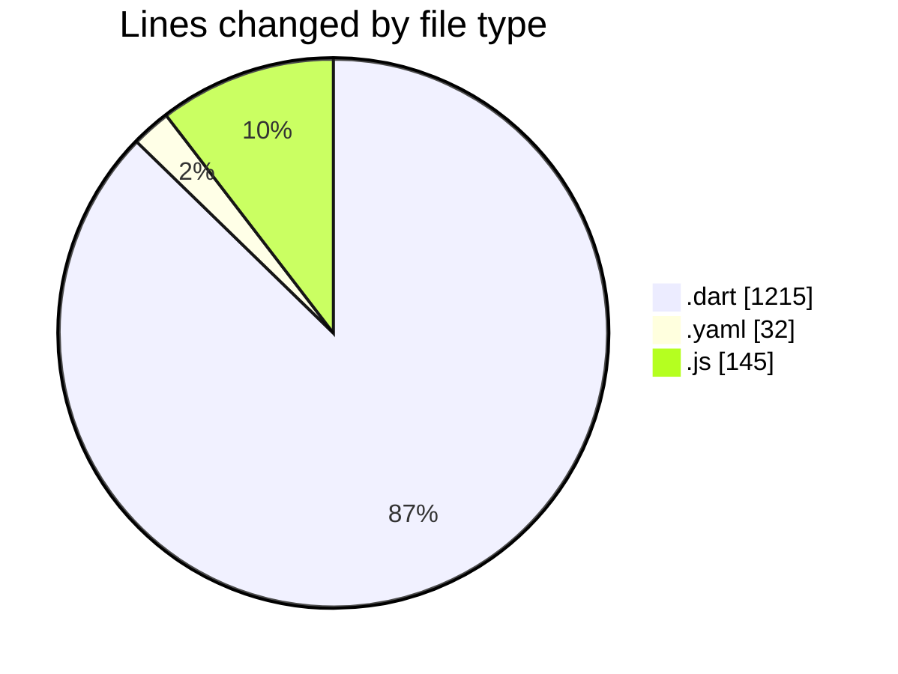
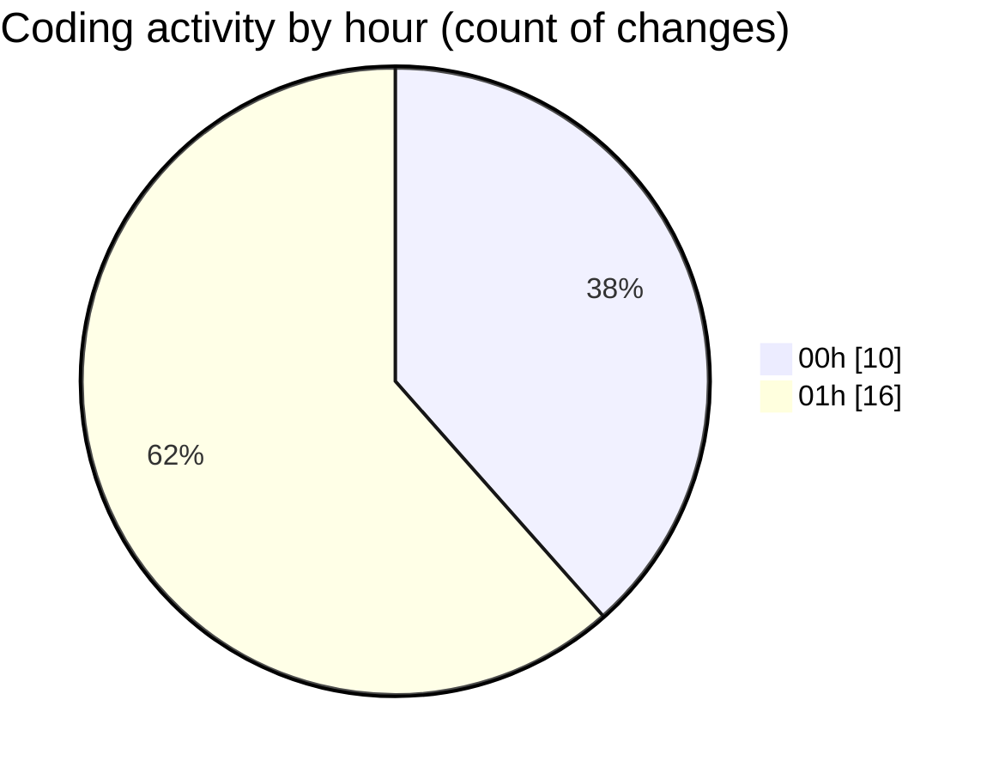

# appProject - Activity Summary 

## Overall Statistics

| Stat                   | Value                                                             |
| ---------------------- | ----------------------------------------------------------------- |
| **Lines Added** (➕)   | 1173                                          |
| **Lines Removed** (➖) | 219                                        |
| **Net Change** (↕)    | 954                |
| **Active Time** (⌚)   | 29 minutes |

## Modified Files
- **firebase_options.dart** (+85, -126)
- **main.dart** (+0, -8)
- **pubspec.yaml** (+17, -15)
- **user_repository.dart** (+0, -21)
- **dashboard_screen.dart** (+52, -49)
- **firebase_data_seeder.dart** (+444, -0)
- **run_firebase_seeder.dart** (+39, -0)
- **firebase_seeder.dart** (+391, -0)
- **firebase_import.js** (+75, -0)
- **quick_import.js** (+70, -0)

## Visualizations

### By File Type (Lines Changed)

### By Hour (Estimated Activity Count)

> **Last Updated:** 7/30/2025, 1:40:48 AM