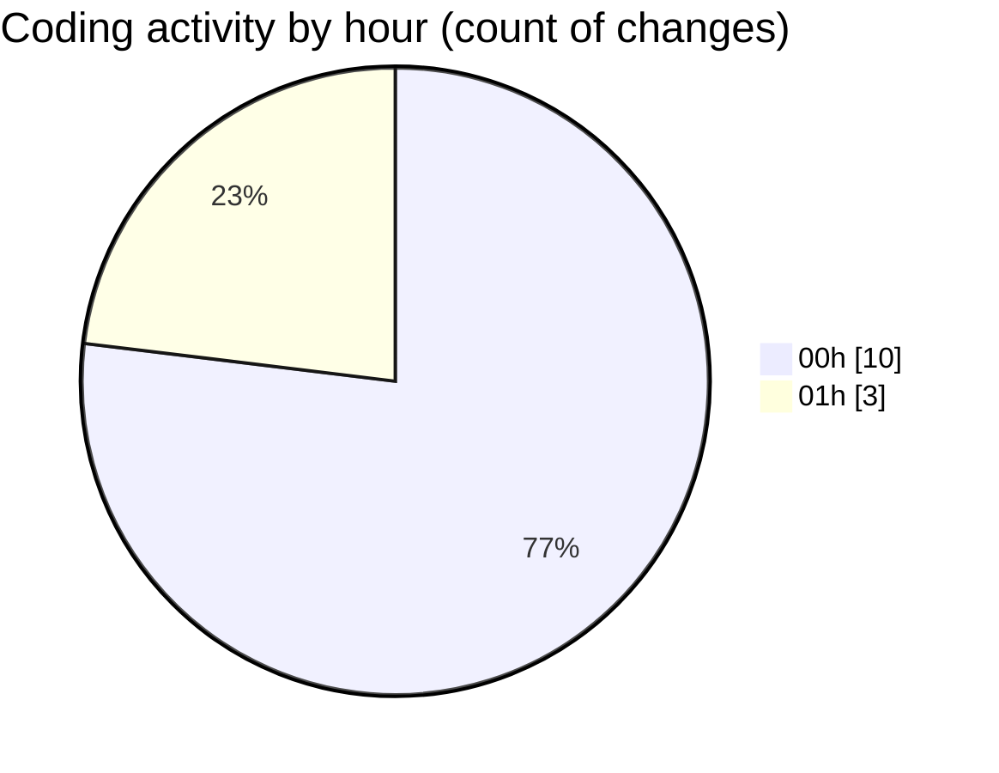

# appProject - Activity Summary 

## Overall Statistics

| Stat                   | Value                                                             |
| ---------------------- | ----------------------------------------------------------------- |
| **Lines Added** (➕)   | 62                                          |
| **Lines Removed** (➖) | 156                                        |
| **Net Change** (↕)    | -94                |
| **Active Time** (⌚)   | 10 minutes |

## Modified Files
- **firebase_options.dart** (+2, -63)
- **main.dart** (+0, -8)
- **pubspec.yaml** (+8, -15)
- **user_repository.dart** (+0, -21)
- **dashboard_screen.dart** (+52, -49)

## Visualizations

### By File Type (Lines Changed)

### By Hour (Estimated Activity Count)

> **Last Updated:** 7/30/2025, 1:20:48 AM