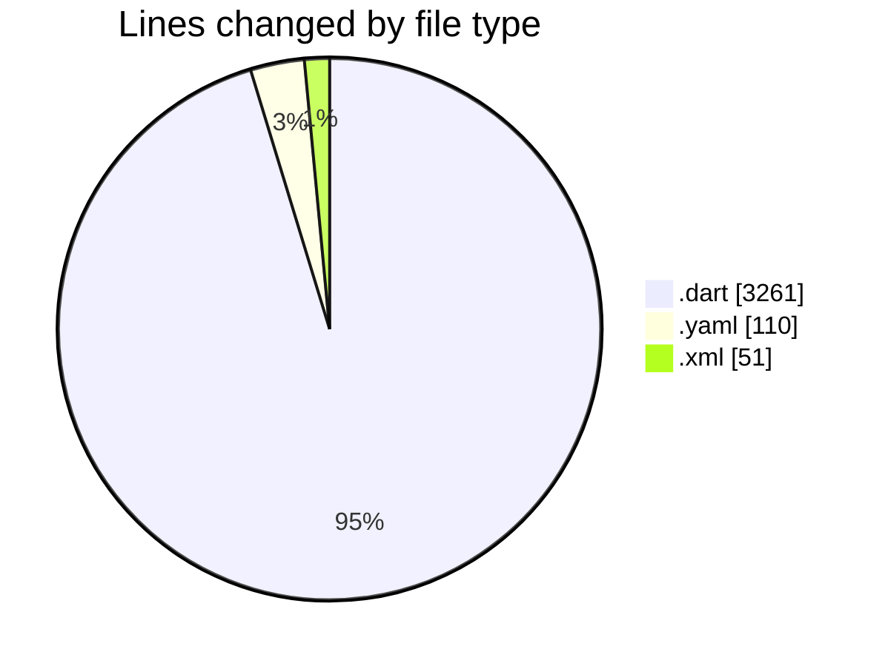
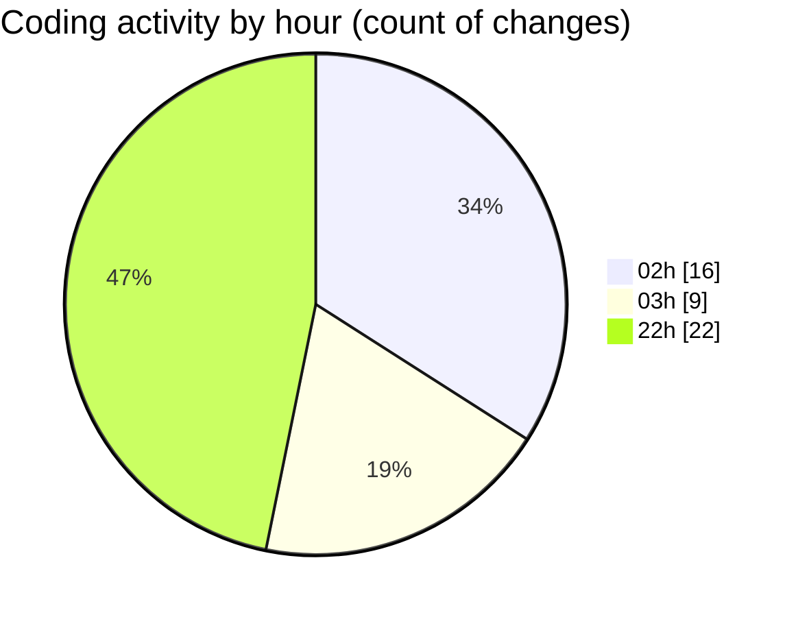

# studyBuddy - Activity Summary 

## Overall Statistics

| Stat                   | Value                                                             |
| ---------------------- | ----------------------------------------------------------------- |
| **Lines Added** (➕)   | 3105                                          |
| **Lines Removed** (➖) | 317                                        |
| **Net Change** (↕)    | 2788                |
| **Active Time** (⌚)   | 45 minutes |

## Modified Files
- **task.dart** (+207, -0)
- **pubspec.yaml** (+110, -0)
- **main.dart** (+110, -3)
- **task_detail_screen.dart** (+346, -0)
- **task_repository.dart** (+259, -0)
- **profile_screen.dart** (+448, -0)
- **loading_indicator.dart** (+43, -0)
- **AndroidManifest.xml** (+51, -0)
- **settings_provider.dart** (+69, -0)
- **settings_screen.dart** (+102, -0)
- **app_theme.dart** (+326, -68)
- **user.dart** (+113, -0)
- **task_list.dart** (+240, -0)
- **home_screen.dart** (+210, -0)
- **profile_screen.dart** (+11, -0)
- **register_screen.dart** (+141, -123)
- **dashboard_screen.dart** (+15, -0)
- **tasks_screen.dart** (+18, -0)
- **calendar_screen.dart** (+18, -0)
- **app_router.dart** (+127, -0)
- **forgot_password_screen.dart** (+141, -123)

## Visualizations

### By File Type (Lines Changed)

### By Hour (Estimated Activity Count)

> **Last Updated:** 7/31/2025, 10:16:54 PM