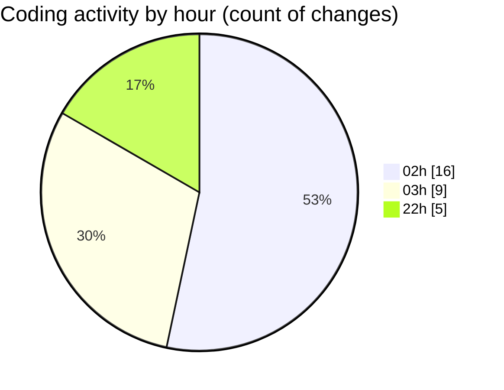

# studyBuddy - Activity Summary 

## Overall Statistics

| Stat                   | Value                                                             |
| ---------------------- | ----------------------------------------------------------------- |
| **Lines Added** (➕)   | 2184                                          |
| **Lines Removed** (➖) | 71                                        |
| **Net Change** (↕)    | 2113                |
| **Active Time** (⌚)   | 28 minutes |

## Modified Files
- **task.dart** (+207, -0)
- **pubspec.yaml** (+110, -0)
- **main.dart** (+110, -3)
- **task_detail_screen.dart** (+346, -0)
- **task_repository.dart** (+259, -0)
- **profile_screen.dart** (+448, -0)
- **loading_indicator.dart** (+43, -0)
- **AndroidManifest.xml** (+51, -0)
- **settings_provider.dart** (+69, -0)
- **settings_screen.dart** (+102, -0)
- **app_theme.dart** (+326, -68)
- **user.dart** (+113, -0)

## Visualizations

### By File Type (Lines Changed)

### By Hour (Estimated Activity Count)

> **Last Updated:** 7/31/2025, 10:11:54 PM