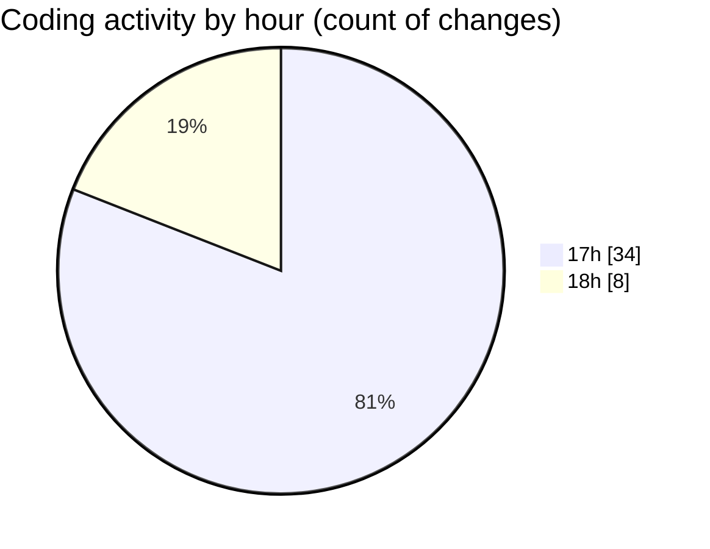

# BOZ-RAT - Activity Summary 

## Overall Statistics

| Stat                   | Value                                                             |
| ---------------------- | ----------------------------------------------------------------- |
| **Lines Added** (➕)   | 3538                                          |
| **Lines Removed** (➖) | 176                                        |
| **Net Change** (↕)    | 3362                |
| **Active Time** (⌚)   | 40 minutes |

## Modified Files
- **package.json** (+28, -0)
- **server.js** (+164, -0)
- **database.js** (+272, -0)
- **index.html** (+127, -0)
- **styles.css** (+221, -0)
- **app.js** (+487, -0)
- **.gitkeep** (+2, -0)
- **package.json** (+43, -8)
- **client.js** (+364, -0)
- **anti-analysis.js** (+208, -0)
- **keylogger.js** (+254, -37)
- **password-recovery.js** (+327, -131)
- **file-manager.js** (+406, -0)
- **screen-capture.js** (+376, -0)
- **build.bat** (+13, -0)
- **start-server.bat** (+11, -0)
- **demo.html** (+235, -0)

## Visualizations

### By File Type (Lines Changed)

### By Hour (Estimated Activity Count)

> **Last Updated:** 8/3/2025, 6:19:14 PM