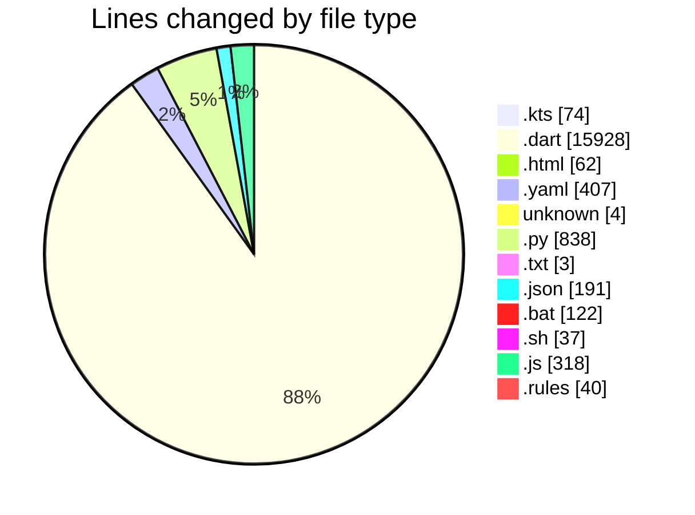
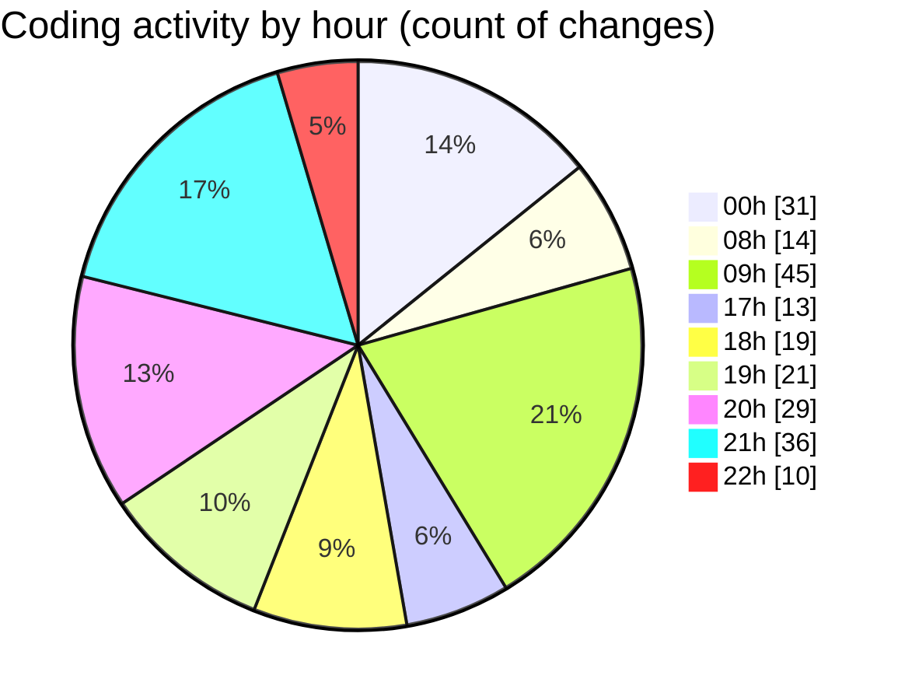

# studyBuddy - Activity Summary 

## Overall Statistics

| Stat                   | Value                                                             |
| ---------------------- | ----------------------------------------------------------------- |
| **Lines Added** (➕)   | 17513                                          |
| **Lines Removed** (➖) | 511                                        |
| **Net Change** (↕)    | 17002                |
| **Active Time** (⌚)   | 260 minutes |

## Modified Files
- **build.gradle.kts** (+46, -0)
- **build.gradle.kts** (+28, -0)
- **app_config.dart** (+21, -0)
- **index.html** (+62, -0)
- **main.dart** (+220, -4)
- **pubspec.yaml** (+406, -1)
- **splash_screen.dart** (+109, -16)
- **register_screen.dart** (+279, -0)
- **auth_form_field.dart** (+120, -0)
- **login_screen.dart** (+526, -6)
- **user_repository.dart** (+568, -45)
- **auth_provider.dart** (+234, -16)
- **shared_prefs_service.dart** (+51, -0)
- **firebase_auth_service.dart** (+199, -0)
- **app_router.dart** (+258, -0)
- **sqlite_database.dart** (+141, -0)
- **sync_service.dart** (+362, -0)
- **task_repository.dart** (+849, -225)
- **task.dart** (+268, -0)
- **task_provider.dart** (+672, -104)
- **connectivity_service.dart** (+87, -0)
- **tasks_screen.dart** (+900, -59)
- **error_display_widget.dart** (+57, -0)
- **empty_state_widget.dart** (+62, -0)
- **task_list.dart** (+72, -0)
- **task_card.dart** (+647, -0)
- **add_task_screen.dart** (+304, -0)
- **calendar_screen.dart** (+932, -0)
- **profile_screen.dart** (+1106, -0)
- **dashboard_screen.dart** (+768, -0)
- **firebase_service.dart** (+65, -25)
- **task_list_item.dart** (+306, -2)
- **app_theme.dart** (+470, -0)
- **gradient_card.dart** (+223, -0)
- **main_screen.dart** (+248, -0)
- **.gitkeep** (+1, -0)
- **.gitkeep** (+1, -0)
- **.gitkeep** (+1, -0)
- **.gitkeep** (+1, -0)
- **task_model.dart** (+85, -0)
- **event_model.dart** (+89, -0)
- **user_model.dart** (+104, -0)
- **event_repository.dart** (+275, -0)
- **task_form_dialog.dart** (+314, -0)
- **task_search_dialog.dart** (+329, -0)
- **event_form_dialog.dart** (+547, -0)
- **crud_demo_screen.dart** (+754, -0)
- **event_provider.dart** (+231, -0)
- **import_data.py** (+409, -1)
- **requirements.txt** (+3, -0)
- **sample_data.json** (+170, -0)
- **import_data.bat** (+39, -0)
- **import_data.sh** (+37, -0)
- **import_data.js** (+318, -0)
- **package.json** (+21, -0)
- **firebase_service.dart** (+108, -7)
- **deploy_production.py** (+428, -0)
- **build_production.bat** (+83, -0)
- **auth_service.dart** (+181, -0)
- **signup_screen.dart** (+388, -0)
- **realtime_service.dart** (+262, -0)
- **notification_service.dart** (+378, -0)
- **firebase_options.dart** (+85, -0)
- **firestore.rules** (+40, -0)
- **empty_state.dart** (+165, -0)

## Visualizations

### By File Type (Lines Changed)

### By Hour (Estimated Activity Count)

> **Last Updated:** 8/3/2025, 10:09:08 PM