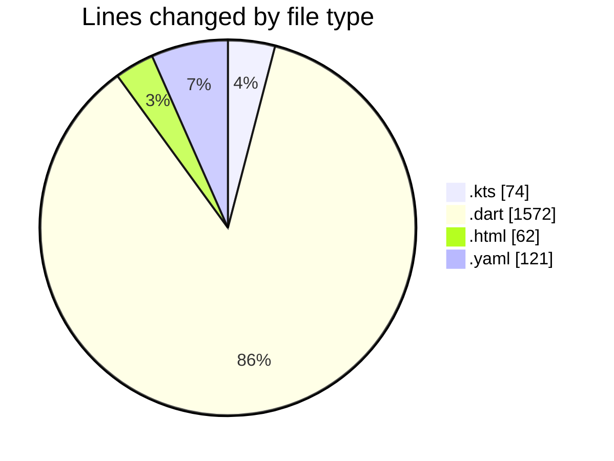
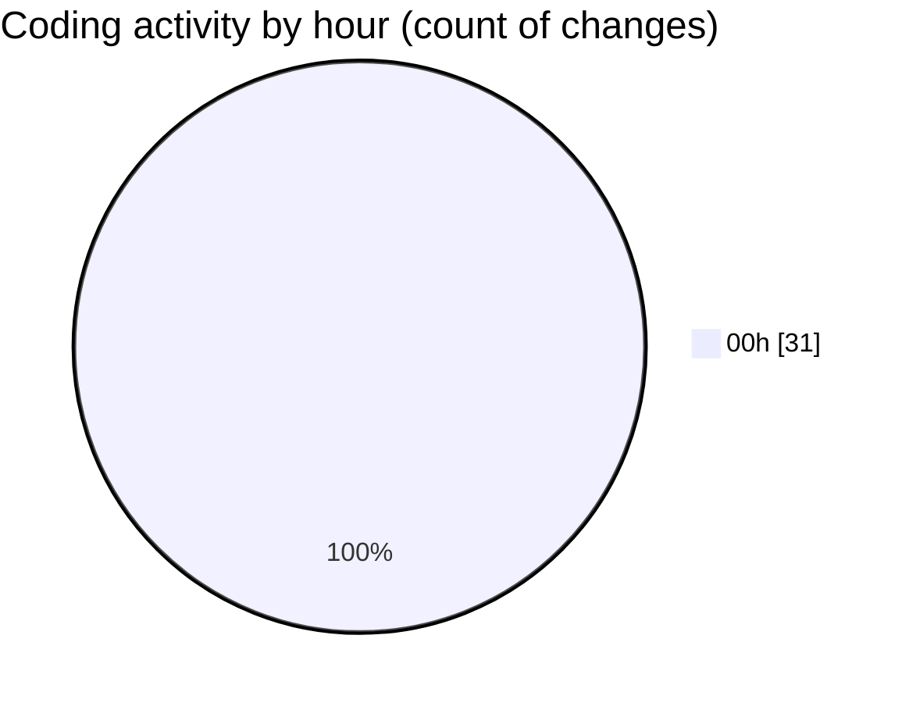

# studyBuddy - Activity Summary 

## Overall Statistics

| Stat                   | Value                                                             |
| ---------------------- | ----------------------------------------------------------------- |
| **Lines Added** (➕)   | 1790                                          |
| **Lines Removed** (➖) | 39                                        |
| **Net Change** (↕)    | 1751                |
| **Active Time** (⌚)   | 41 minutes |

## Modified Files
- **build.gradle.kts** (+46, -0)
- **build.gradle.kts** (+28, -0)
- **app_config.dart** (+21, -0)
- **index.html** (+62, -0)
- **main.dart** (+64, -0)
- **pubspec.yaml** (+121, -0)
- **splash_screen.dart** (+109, -16)
- **register_screen.dart** (+279, -0)
- **auth_form_field.dart** (+58, -0)
- **login_screen.dart** (+200, -6)
- **user_repository.dart** (+191, -1)
- **auth_provider.dart** (+234, -16)
- **shared_prefs_service.dart** (+51, -0)
- **firebase_auth_service.dart** (+199, -0)
- **app_router.dart** (+127, -0)

## Visualizations

### By File Type (Lines Changed)

### By Hour (Estimated Activity Count)

> **Last Updated:** 8/3/2025, 12:45:38 AM