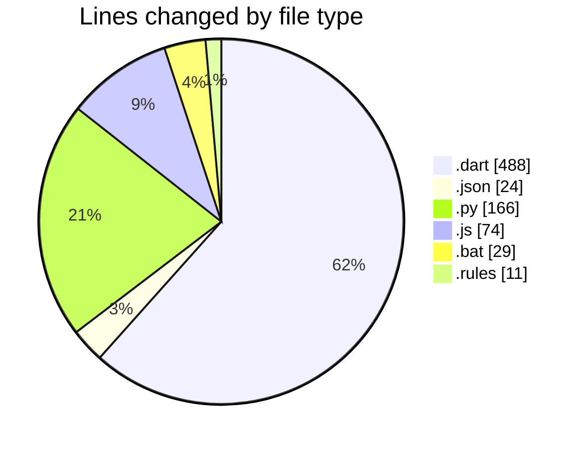
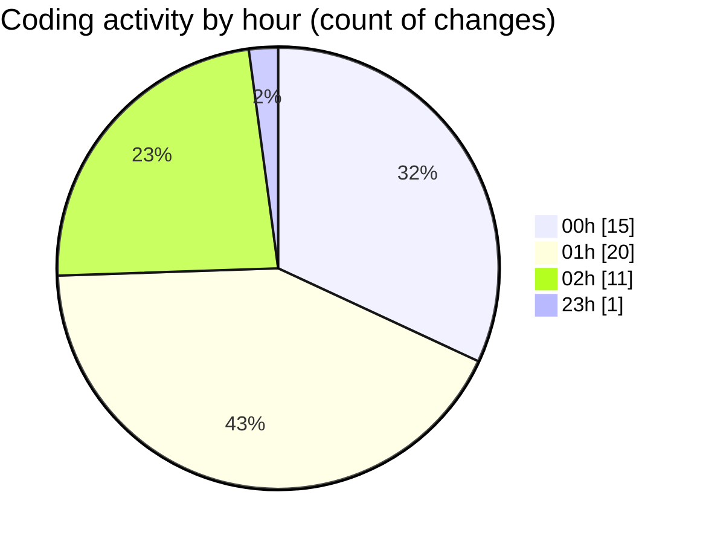

# studyBuddy - Activity Summary 

## Overall Statistics

| Stat                   | Value                                                             |
| ---------------------- | ----------------------------------------------------------------- |
| **Lines Added** (➕)   | 727                                          |
| **Lines Removed** (➖) | 65                                        |
| **Net Change** (↕)    | 662                |
| **Active Time** (⌚)   | 54 minutes |

## Modified Files
- **task_provider.dart** (+53, -11)
- **tasks_screen.dart** (+89, -1)
- **task_repository.dart** (+145, -0)
- **firebase.json** (+20, -0)
- **firestore.indexes.json** (+4, -0)
- **firebase_service.dart** (+9, -0)
- **main.dart** (+73, -16)
- **notification_service.dart** (+65, -26)
- **delete_all_tasks.py** (+76, -0)
- **delete_all_tasks.js** (+74, -0)
- **delete_tasks.bat** (+29, -0)
- **delete_tasks_simple.py** (+90, -0)
- **firestore.rules** (+0, -11)

## Visualizations

### By File Type (Lines Changed)

### By Hour (Estimated Activity Count)

> **Last Updated:** 8/4/2025, 2:39:09 AM