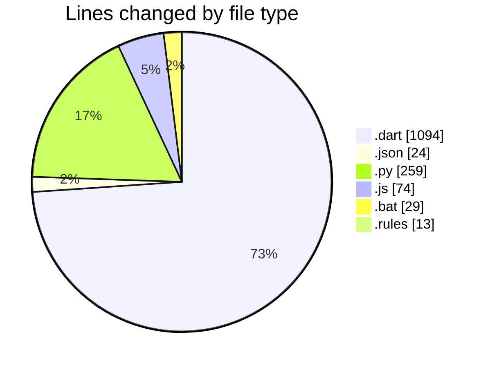
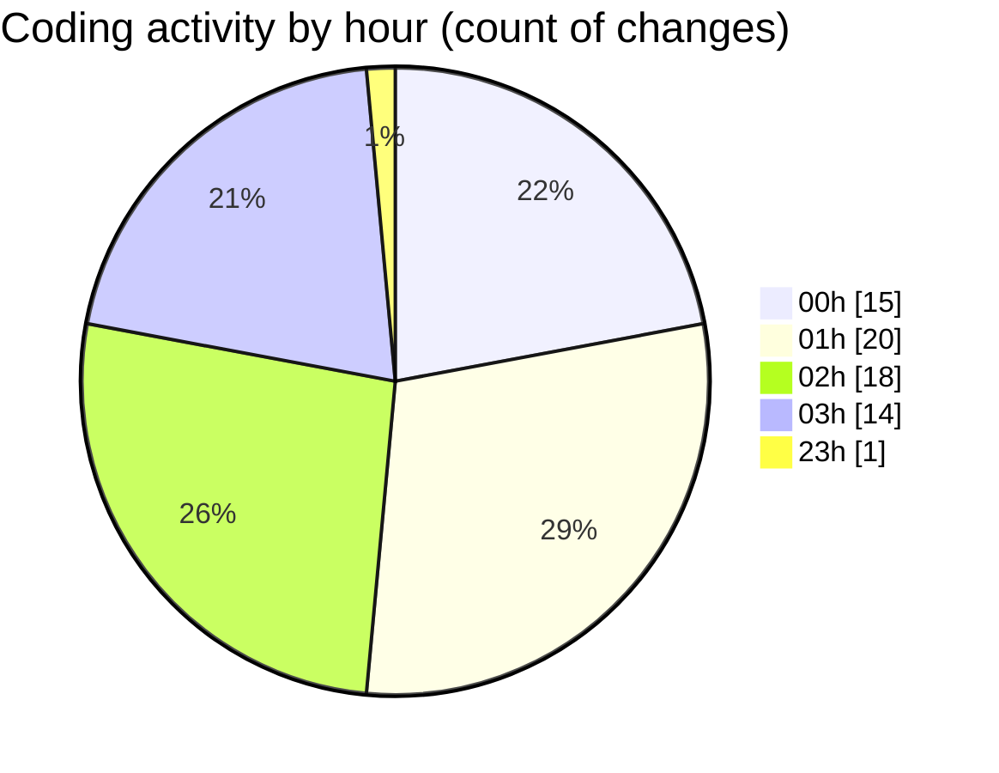

# studyBuddy - Activity Summary 

## Overall Statistics

| Stat                   | Value                                                             |
| ---------------------- | ----------------------------------------------------------------- |
| **Lines Added** (➕)   | 1173                                          |
| **Lines Removed** (➖) | 320                                        |
| **Net Change** (↕)    | 853                |
| **Active Time** (⌚)   | 87 minutes |

## Modified Files
- **task_provider.dart** (+77, -11)
- **tasks_screen.dart** (+89, -1)
- **task_repository.dart** (+178, -18)
- **firebase.json** (+20, -0)
- **firestore.indexes.json** (+4, -0)
- **firebase_service.dart** (+9, -0)
- **main.dart** (+74, -16)
- **notification_service.dart** (+65, -26)
- **delete_all_tasks.py** (+76, -0)
- **delete_all_tasks.js** (+74, -0)
- **delete_tasks.bat** (+29, -0)
- **delete_tasks_simple.py** (+90, -0)
- **firestore.rules** (+0, -13)
- **user.dart** (+150, -0)
- **import_userid.py** (+93, -0)
- **dashboard_screen.dart** (+13, -0)
- **user_repository.dart** (+0, -235)
- **user_provider.dart** (+132, -0)

## Visualizations

### By File Type (Lines Changed)

### By Hour (Estimated Activity Count)

> **Last Updated:** 8/4/2025, 3:49:09 AM