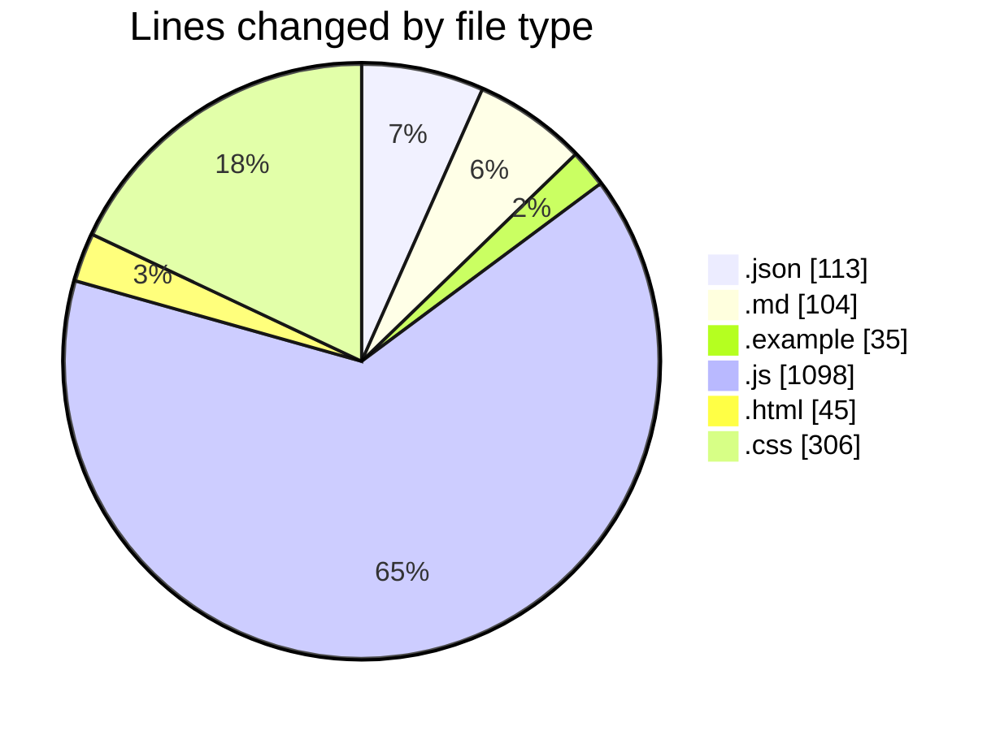
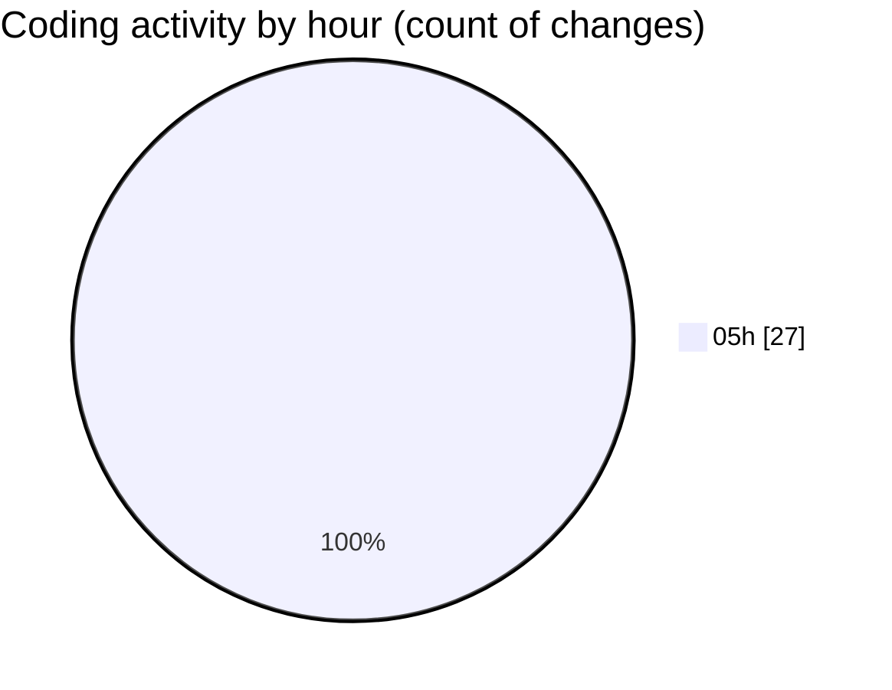

# napXUVN - Activity Summary 

## Overall Statistics

| Stat                   | Value                                                             |
| ---------------------- | ----------------------------------------------------------------- |
| **Lines Added** (➕)   | 1701                                          |
| **Lines Removed** (➖) | 0                                        |
| **Net Change** (↕)    | 1701                |
| **Active Time** (⌚)   | 26 minutes |

## Modified Files
- **package.json** (+20, -0)
- **README.md** (+104, -0)
- **package.json** (+35, -0)
- **env.example** (+35, -0)
- **server.js** (+116, -0)
- **User.js** (+172, -0)
- **Transaction.js** (+223, -0)
- **auth.js** (+147, -0)
- **errorHandler.js** (+82, -0)
- **auth.js** (+306, -0)
- **package.json** (+58, -0)
- **index.html** (+45, -0)
- **index.js** (+52, -0)
- **index.css** (+306, -0)

## Visualizations

### By File Type (Lines Changed)

### By Hour (Estimated Activity Count)

> **Last Updated:** 8/5/2025, 5:23:08 AM